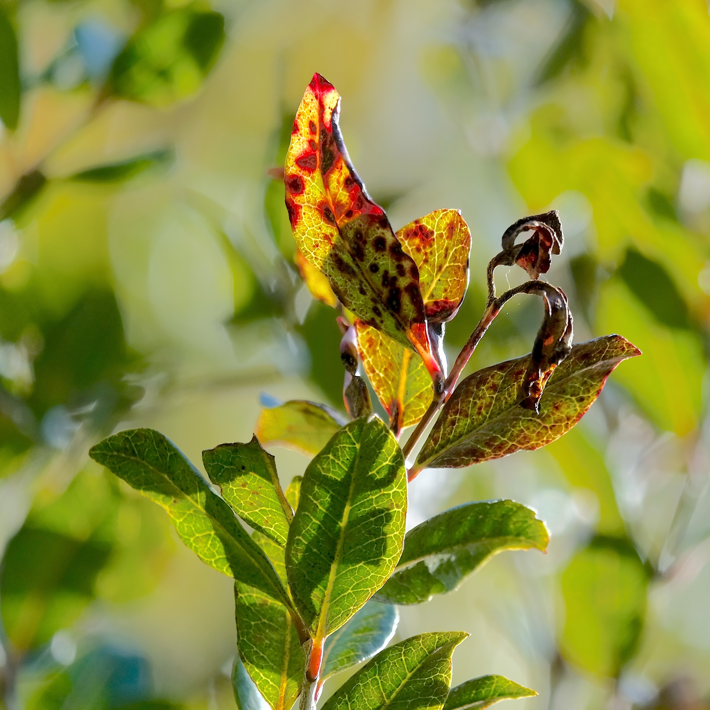

# Introduction {#sec-introduction}

## Global Emergence and Spread of Myrtle Rust

The spread of invasive fungal pathogens is increasingly impacting forest ecosystems worldwide, with their dispersion to new areas partially facilitated by ever-increasing global trade and travel [@paapInvasionFrameworks2022; @wingfieldunifiedframework2017; @grgurinovicEucalyptusrust2006]. Rust fungi belong to the diverse phylum Basidiomycota and are biotrophic plant parasites [@helferRustfungi2014]. One member of the rust fungi, , formerly *Puccinia psidii* [@beenkenAustropuccinianew2017], has a broad host range outside its native habitat. Originating from South and Central America, one biotype of this fungus is considered pandemic and spread to Hawaii, Australia, Southeast Asia, China, Japan, and New Zealand [@granadospandemicbiotype2017; @stewartGeneticdiversity2018; @duplessispandemicstrain2019]. Globally,  infects approximately 480 Myrtaceae species [@soewartoj.Austropucciniapsidii2019], causing the disease commonly known as . Due to the lack of co-evolution, Oceanic Myrtaceae did not have the opportunity to adapt to , making them epidemiologically naïve to the pathogen and, as a result, more susceptible [@makinsonMyrtleRust2018]. Whilst it is thought that  has arrived in New Zealand in 2017 via wind, its urediniospores can also spread by humans, birds or insects [@magyarDispersalStrategies2016; @schmidShortCommunication2021].


## Plant-level Symptoms of Myrtle Rust

 spores infect the host-plant only on actively growing tissue like young shoots, developing leaves and fruits [@boufleurDiagnosticGuide2023; @glenPucciniapsidii2007; @chockglobalthreat2020]. After germination and a latent period of approximately two weeks, the symptoms start to show (@fig-symptoms; Beresford et al., 2020). Initially, the growing uredinial spores form yellow pustules (@fig-pustules). These growth areas turn into red blotches on leaves, killing the photosynthetic tissue and preventing the growth of new meristematic tissue, leading to the death of shoot tips (@fig-red_blotches) and flowers. Sustained infection ultimately leads to substantial defoliation (@fig-smaire_stand; Boufleur et al., 2023). Hence, infection hinders the host to produce new photosynthetic tissue and development of seeds, disrupting the reproductive cycle [@fenshamUnprecedentedextinction2021]. In severe cases, sustained tissue loss and inability to produce new seeds can render the host infertile, ultimately leading to mortality [@fenshamUnprecedentedextinction2021]. Even when seed production is not entirely suppressed and seedlings germinate, they are highly susceptible to infection, severely limiting regeneration [@fernandez-winzerDirectindirect2020]. Such reproduction failure has raised concerns that highly susceptible species may face extinction within a single generation [@fenshamUnprecedentedextinction2021; @carnegieImpactinvasive2016]. As a consequence, this may have cascading effects across trophic levels, impacting birds, insects, and other organisms that depend on these species as habitat or food [@sutherlandMonitoringAustropuccinia2020].


:::: {#fig-symptoms fig-scap="Myrtle rust symptoms on *S. maire*."}

::: {layout="[1,-0.05,1]"}
{#fig-pustules}

{#fig-red_blotches}
:::

The  symptoms showing the advancement of  infection on *S. maire*. Initial growth of yellow urediniospores on leaves (**a**), and necrotic lesions and shoot tip dieback (**b**).
::::

## Consequences of Myrtle Rust for New Zealand

Since the pathogen's arrival in 2017 in New Zealand, at least 13 out of 30 native [@delangeConservationstatus2024] and 17 exotic Myrtaceae species are confirmed as hosts [@toome-hellerChasingmyrtle2020]. Given the potential consequences of  infection,  poses far-reaching implications across ecological, cultural and economic systems of Aotearoa. In woody ecosystems successional plant communities and Myrtaceae-dominated old-growth forests are at most risk [@mccarthyFunctionalAssessment2024]. Widespread loss of Myrtaceae from  would cause substantial changes to the functional structure of New Zealand's forests, particularly if multiple Myrtaceae species become infected at the same site and co-occurring species lack the capacity to compensate for their loss [@mccarthyFunctionalAssessment2024]. Myrtaceae species are keystone species, and birds, reptiles, bats and invertebrates feed on their nectar [@sutherlandMonitoringAustropuccinia2020; @joEcologicalimportance2022;@gailbraithImplicationsselected2017]. Furthermore, bats are reported to hunt for invertebrates above Myrtaceae [@gailbraithImplicationsselected2017]. However, while birds, bats and reptiles are projected to be flexible enough to overcome decline of Myrtaceae, some invertebrates are thought to have an obligate relationship with Myrtaceae species [@gailbraithImplicationsselected2017]. Beyond ecological concerns, many Myrtaceae are taonga (treasure) species which hold profound cultural and spiritual significance for Māori [@teulonthreatmyrtle2015]. Furthermore, Myrtaceae species have significant economic value [@essienValueaddedpotential2019]. Mānuka (*Leptospermum scoparium*) honey generated NZ$538 million in 2022 and is projected to rise to over NZ$1 billion by 2030 [@apiculturenewzealandNewZealand2024]. Consequently, there is considerable concern about the long-term impact of  on the Myrtaceae species, because of their importance to Māori culture, the New Zealand economy, and its ecosystems.

## Management and Mitigation Strategies

 is considered to be established in New Zealand since 2018, and efforts are focused on long-term mitigation [@ministryforprimaryindustriesNewapproach2020]. Current strategies are targeted at protecting susceptible species and reducing the rate of spread [@beresfordGuidemyrtle2025]. These include removal of infected plant parts, or entire plants with minimal disturbance, and disposal in a manner that minimises the risk of further spore dispersal. Where possible, pruning is recommended during cooler seasons to avoid stimulating new growth. Additionally, clothing and equipment should be disinfected between sites. Synthetic fungicides offer an additional option for reducing infection severity and have shown to be highly effective in treating  with low phytotoxicity [@beresfordRiskbasedfungicide2022; @chngPotentialdisease2019]. However, their effectiveness depends on regular application, making them costly and impractical for large-scale use [@sutherlandMonitoringAustropuccinia2020]. Nevertheless, fungicide treatment may be viable in cases where only a small number of trees require protection, provided that their exact locations are known. 


## *S. maire*: Ecology, Significance, and Conservation Challenges

### Biology and Taxonomy

*Syzygium* is the most diverse tree genus globally, comprising over 1000 species [@lowGenomicinsights2022], and serves as an important food source for birds, mammals and insects across the tropical Indo-Pacific [@parnellj.a.n.MattersScale2007]. Within New Zealand,  is the only native species of the Syzygium genus [@delangeConservationstatus2024].  is a slender tree and can grow up to 16 m tall with numerous branches and a compact crown, comprised of ~1.5 cm wide and ~5cm long leaves (@fig-smaire). It is characterised by specialised pneumatophores (aerial roots), enabling it to inhabit waterlogged soils. Between January and April, healthy and mature individuals produce white brush flowers and bright red, one-seeded edible berries alongside immature green fruit [@delangeConservationstatus2024; @taranakiregionalcouncilBiodiversity; @Keikonei].

:::: {#fig-smaire fig-scap="Examples of *S. maire*."}

::: {layout="[1, -0.05, 1]"}
{#fig-smaire_stand}

{#fig-smaire_aerial}
:::

Examples of  in urban parks of a separated stand (**a**) and surrounded by vegetation (**b**). Arrows indicate tree locations; colours represent dieback severity (white = limited, light red = advanced, red = severe mortality).
::::

### Distribution, Habitat, and Conservation Status

 indicate that 's historical habitat spanned from the north of the South Island across most parts of the North Island [@mccarthySpeciesdistribution2019].  is most commonly found in lowland wetlands with low water tables and along stream gullies [@mccarthySpeciesdistribution2019; @delangeConservationstatus2024]. Its pneumatophores enable it to be a dominant component of swamp forests, where it often occurs alongside pukatea (*Laurelia novae-zelandiae*), a more widespread generalist species with similarly small leaves (3 × 6 cm; Mahuta
et al., 2021; Manaaki Whenua - Landcare Research, 2025). Other co-occurring species include tawa (*Beilschmiedia tawa*), which also possess small leaves (1.4 × 6 cm), though narrower than those of  [@manaakiwhenua-landcareresearchNewZealand2026], and climbing plants such as kiekie (*Freycinetia banksii*), and supplejack (*Ripogonum scandens*; Singers & Rogers, 2014), which may establish within the canopy of . In addition, human-driven deforestation and land drainage have restricted  to a fraction of its original distribution. It is estimated that only 10% of New Zealand's wetlands are still intact [@dymondRevisedextent2021]. Consequently,  is in decline and classified as "Threatened--Nationally Vulnerable" [@delangeConservationstatus2024], New Zealand's highest extinction risk category [@andrewj.townsendNewZealand2008]. 

### Ecological and Cultural Significance

Ecologically,  plays a critical role in forest structure and function. Its fruits provide a food source for native birds including kererū (*Hemiphaga novaeseelandiae*), tūī (*Prosthemadera novaeseelandiae*), and korimako (*Anthornis melanura*; Van Der Walt et al., 2020), and its presence provides structural habitat and shelter for some of New Zealand's most threatened freshwater fish species [@Keikonei]. Notably,  can achieve reproductive maturity early, with fruit production documented in individuals five to ten years old [@balkwillAdaptivePotential2025]. Like other Myrtaceae species,  holds profound cultural and spiritual significance for Māori as taonga species, valued as a source of kai (food), rongoā (medicine), dye, perfume or air-freshener, and timber weapons for self-defence [@Keikonei; @gouldAntioxidantactivities2006; @taranakiregionalcouncilBiodiversity; @balkwillDenovoassembly2024]. This cultural importance, combined with its ecological role in swamp forests, ecosystems that have suffered widespread loss in Aotearoa, underscores the conservation urgency for this species.

### Susceptibility to Myrtle Rust and Research Gaps

 infection severity varies widely among host species [@fernandezwinzerAustropucciniapsidii2019].  is one of the most susceptible Myrtaceae species to  infection [@schmidShortCommunication2021; @beresfordGuidemyrtle2025], with mature trees capable of dying within three years of initial infection [@delangeConservationstatus2024]. Upon 's arrival in New Zealand, the biology of  remained scarcely researched and understood, contributing to the absence of a robust conservation strategy. However, this research gap is being progressively closed, with recent publications exploring genome assembly [@balkwillDenovoassembly2024], adaptive potential [@balkwillAdaptivePotential2025], and reproductive strategies [@bettoniSexualasexual2024]. Ex-situ cryopreservation of  seeds is also being investigated as a potential long-term conservation option, though practical application remains unfeasible [@vanderwaltInvestigatingcryopreservation2021; @vanderwaltAdvancescryopreservation2023; @vanderwaltImpactsRapid2022; @vanderwaltSeeddevelopment2020; @nadarajanIntegratedex2021]. Furthermore,  seeds exhibit characteristics that prevent successful long-term freezing [@vanderwaltAdvancescryopreservation2023], limiting the viability of seed banking as a standalone conservation strategy. These constraints place further emphasis on the urgent need for in-situ conservation efforts, including improved mapping and monitoring of remaining populations.

## Current Mapping of 

Currently,  is predominantly mapped using community science platforms like iNaturalist. While iNaturalist is increasingly recognised as a valuable tool in biodiversity research and used to develop species distribution models [@masoniNaturalistaccelerates2025], its data is inherently biased to areas with higher human activity and accessibility. Geurts et al. [-@geurtsTurningobservations2023] found that 94% of observations are within 1 km of roads, demonstrating the spatial bias of such opportunistic datasets. Additionally, local conservation groups, such as the [Kaipātiki Project](https://kaipatiki.org.nz/our-work/eskdale-reserve/) or Friends of Bushglen Reserve, maintain records of  locations within their management areas. These known populations can provide the basis for developing and validating automated detection methods. Beyond discovering novel stands, -based detection offers the advantage of automating repeated monitoring to track tree health, growth, and infection progression over time. Another approach consists of , in which a multifactorial  analysis is developed to identify their most probable habitat. Such a model already exists for the greater Wellington region for  [@herbertIdentifyingpotentially2025]. However, such models only predict the likelihood of occurrence, but not their exact location, which is critical for current management approaches for .

 has become a widely used tool for tree species identification [@changApplicationUAV2025; @zhongReviewTree2024] and represents a promising option to close the mapping gap for , which could be built on  outputs. However, applying these methods to  presents inherent challenges: the species' rarity makes gathering of reference data challenging, its morphological overlap with co-occurring species, such as pukatea and tawa, complicates identification, and the potential for climbing plants to establish within its canopy further obscures individual trees for detection on aerial imagery.


## Deep Learning for Species Mapping

Tree detection in aerial imagery has followed the broader computer vision trend toward  solutions [@lecunDeeplearning2015]. Even though still used [@boschDetecTreeTree2020; @malekEfficientFramework2014; @mirakiIndividualtree2021; @safonovaIndividualTree2021], conventional  methods, such as  or  that classify individual pixels independently, have been outperformed by  methods [@liuComparingfully2018], which can even outperform humans in some cases [@alzubaidiReviewdeep2021]. Many studies focus on tree segmentation as their primary objective: detecting individual trees regardless of species [@ballAccuratedelineation2023; @ganTreeCrown2023; @ulkuDeepSemantic2022]. Beyond this foundational step, a more advanced and challenging task involves species-level classification, where trees are identified and assigned to their respective species [@kattenbornConvolutionalNeural2019; @lobotorresApplyingFully2020; @briechleClassificationTree2020; @zhongIndividualTree2024]. To achieve this species-level accuracy, there is a myriad of different methodologies available, which broadly fall into two categories. These are based on their underlying data type: architectures designed for 2D-sensed data, such as  that learn hierarchical spatial features from regular grid data (e.g.  or satellite imagery), and architectures for 3D-sensed  data that operate on voxelised or point-cloud representations. Both are widely used; however, because 2D approaches can draw on a broader range of data sources ( imagery,  imagery,  imagery) and are often more cost-effective to acquire, there is substantially more  research in  based on 2D-sensed than on 3D-sensed data (@fig-bibliostats; Zhong et al., 2024).

:::: {#fig-bibliostats fig-scap="Publications on grid- and point-based deep learning articles."}

::: {layout="[-0.1, 0.85, -0.1]"}

```{python}
import pandas as pd
import matplotlib.pyplot as plt

# Load the CSV files
raster_df = pd.read_csv('../2_1_figures/introduction/raster_dl.csv')
point_df = pd.read_csv('../2_1_figures/introduction/pointcloud_dl.csv')


# Merge and sort
merged_df = pd.merge(raster_df, point_df, on='Publication Year', suffixes=('_raster', '_point'))
merged_df = merged_df.sort_values(by='Publication Year')
merged_df = merged_df[merged_df['Publication Year'] >= 2015]

# Set font to Arial
plt.rcParams['font.family'] = 'Arial'

# Plot
plt.figure(figsize=(10, 6))
bar_width = 0.4
years = merged_df['Publication Year']
x = range(len(years))

# Bars on top of grid
raster_bars = plt.bar([i - bar_width/2 for i in x], merged_df['Count_raster'], width=bar_width,
                      color='#3a6b90ff', label='2D-sensed DL', zorder=3)
point_bars = plt.bar([i + bar_width/2 for i in x], merged_df['Count_point'], width=bar_width,
                     color='#6a974cff', label='3D-sensed DL', zorder=3)

for i in range(1, len(merged_df)):
    raster_prev = merged_df['Count_raster'].iloc[i - 1]
    raster_curr = merged_df['Count_raster'].iloc[i]
    point_prev = merged_df['Count_point'].iloc[i - 1]
    point_curr = merged_df['Count_point'].iloc[i]

    if raster_prev > 0:
        raster_pct = ((raster_curr - raster_prev) / raster_prev) * 100
        plt.text(i - 0.2, raster_curr + 30, f'+{raster_pct:.1f}%',
                 ha='center', va='bottom', rotation=90,
                 fontsize=11, color='#274963ff', #fontweight='bold',
                 bbox=dict(facecolor='white', edgecolor='none', pad=2
                 ))
    if point_prev > 0:
        point_pct = ((point_curr - point_prev) / point_prev) * 100
        plt.text(i + 0.2, point_curr + 30, f'+{point_pct:.1f}%',
                 ha='center', va='bottom', rotation=90,
                 fontsize=11, color='#3a532aff', #fontweight='bold',
                 bbox=dict(facecolor='white', edgecolor='none', pad=2
                 ))

# Axis labels with larger font size
plt.xlabel('Year', fontsize=14)
plt.ylabel('Count', fontsize=14)

# Tick labels larger
plt.xticks(x, years, rotation=45, fontsize=10)
plt.yticks(fontsize=11)

# Remove tick lines but keep labels
plt.tick_params(axis='y', length=0)

# Grid behind bars
plt.grid(axis='y', linestyle='--', alpha=0.7, zorder=0)

# Legend with larger font and no outline
plt.legend(fontsize=14, frameon=False, loc='upper center', bbox_to_anchor=(0.2, 0.91), facecolor='white')
# Remove plot outline
plt.gca().spines['top'].set_visible(False)
plt.gca().spines['right'].set_visible(False)
plt.gca().spines['left'].set_visible(False)
plt.gca().spines['bottom'].set_visible(False)

plt.tight_layout()

plt.show()
```

:::

Total count and percentage increase between successive years of peer-reviewed scientific articles in the field of  related to  from 2015 - 2025. Blue represents publications related to 2D-sensed and green to 3D-sensed data. Search terms can be found in Appendix B and were retrieved from OpenAlex [@priemOpenAlexfullyopen2022].
::::


## Deep Learning for Tree Species Identification

### 2D Semantic Segmentation

 were originally designed for whole-image classification tasks [@krizhevskyImageNetclassification2017] and have been applied by community science tools like iNaturalist, Flora Incognita, and Pl@ntNet to identify plant species from photographs [@waldchenAutomatedplant2018; @dyrmannPlantspecies2016]. These networks revolutionised object detection through their capacity to analyse image texture (contextual information from clusters of neighbouring pixels) rather than evaluating pixels in isolation [@cholletXceptionDeep2017]. They autonomously learn which textural patterns (such as leaf morphology or canopy characteristics) are relevant for distinguishing vegetation communities and species [@dyrmannPlantspecies2016]. In these architectures, sequential pooling operations aggregate feature maps to progressively coarser spatial scales, with the final layer indicating only whether distinct (species) features appear anywhere within the image, without preserving their spatial locations. This self-learning capacity provides substantial advantages in computational efficiency and automation, eliminating manual feature engineering required for traditional  [@maggioriHighResolutionAerial2017]. Combined with advances in high-resolution sensors,  currently transform vegetation mapping capabilities.

However, -based vegetation mapping demands more than whole-image classification can provide. For mapping applications, success depends not on detecting whether the target class exists, but on determining its precise spatial location throughout the imagery, requiring spatially-continuous, detailed classification across entire image extents [@kattenbornConvolutionalNeural2019].  address this limitation by retaining and reconstructing the spatial locations of contextual features through encoder-decoder structures. These networks extract contextual features whilst preserving spatial origin, enabling fine-grained, spatial segmentation at the original imagery resolution [@maggioriHighResolutionAerial2017; @ronnebergerUNetConvolutional2015].

U-Net, originally developed for biomedical image segmentation [@ronnebergerUNetConvolutional2015], has become a widely adopted  architecture for species detection in  [@freudenbergLargeScale2019; @lakeDeeplearning2022; @kattenbornConvolutionalNeural2019; @ulkuDeepSemantic2022; @zhangIdentifyingmapping2020; @wagnerUsingUnet2019]. The U-shaped encoder-decoder architecture progressively reduces spatial resolution whilst increasing feature channels, enabling efficient pixel-wise semantic classification. Although numerous  architectures exist, their performance tends to be comparable to U-Net's [@lobotorresApplyingFully2020]. In  approaches, imagery is predominantly used with traditional  methods such as , yet is barely employed in -based studies [@zhongReviewTree2024].

### 3D Instance Segmentation and Point Cloud Processing

For 3D  data, specialised neural network architectures have been developed to process forest point clouds. These methods leverage the vertical dimension and 3D tree crown geometry to discriminate between species, offering complementary information to spectral approaches [@zhongIndividualTree2024; @henrichTreeLearndeep2024]. Two primary architectural approaches exist: voxel-based methods that convert point clouds into regular 3D grids suitable for convolutional operations [@lecigneExploringtrees2018; @xiangAutomatedforest2024], and point-based architectures such as PointNet++ that process raw point coordinates directly whilst preserving geometric detail [@Qipointnet2017]. Recent studies have demonstrated successful species identification across diverse forest types using these approaches [@briechleClassificationTree2020].

However, point cloud data presents unique preprocessing challenges compared to imagery. Unlike raster data where spatial dimensions are standardised through tile size, point clouds contain variable numbers of points depending on forest structure and acquisition parameters. For species-level classification, individual trees must first be isolated [@briechleClassificationTree2020]. This tree instance segmentation can be achieved through graph-based methods such as Treeiso [@xi3DGraphBased2022] or deep learning approaches like TreeLearn [@henrichTreeLearndeep2024]. Once individual trees are extracted, point counts must be normalised to provide consistent neural network inputs, either through voxelisation into fixed grid sizes or through resampling to a standard number of points per tree. These preprocessing requirements add complexity but enable the exploitation of 3D structural information to potentially use for species identification.

## Scope and Novelty

A critical challenge to detect rare species is severe class imbalance combined with limited training data. Most published studies report target classes comprising 30--50% of annotated pixels [@lobotorresApplyingFully2020], whereas rare species in complex, biodiverse forests present significantly different characteristics. These challenges create a substantial gap between studies on readily detectable species [@pearseDeepLearning2021] and operational requirements for rare species in complex ecosystems.  shares morphological similarities with co-occurring native species, possesses small leaves that are difficult to resolve at typical  flight altitudes, and is a rare and conservation-critical New Zealand tree species highly vulnerable to . These characteristics, combined with its active management in local parks and forests, make it an ideal species for a case study to evaluate whether current deep learning approaches can successfully map rare, morphologically inconspicuous species in complex forest environments.

Therefore, this thesis addresses four research questions: (1) Can current  approaches successfully detect and delineate  in complex, dense native forest despite severe class imbalance, morphological similarity to co-occurring species, and limited training data? (2) How do spectral characteristics ( imagery vs.  imagery) and hyperparameter configurations affect detection performance? (3) Can models that are trained on multiple sites generalise across all locations and outperform models trained on a single site? (4) Can readily available 3D LiDAR-based point-cloud segmentation algorithms supplement 2D-based  detection?

To address these questions, two complementary methodologies were evaluated to test whether structural and spectral information could improve detection under the given constraints: (1) a 2D  semantic segmentation approach using  imagery and  imagery data, which exploits spectral and spatial texture information at high resolution, and (2) a 3D point cloud-based approach using  data with tree instance segmentation (@fig-wf_overall). We hypothesise that structural information (3D crown geometry, vertical position relative to other trees) and spectral information (foliage reflectance, vegetation indices) may provide complementary signals for species discrimination, particularly for small-leaved species where morphological distinctiveness is subtle. While the deep learning portion of this thesis ultimately focusses on the first method, the evaluation aimed to assess how both these methods could benefit species discrimination. Furthermore, evaluating both methods provides insights into whether complex forest environments require multi-modal data fusion or whether single modalities suffice under current sensor and algorithmic constraints.

:::: {#fig-wf_overall fig-scap="Overview methodology workflow."}

::: {}
```{mermaid}
%%| fig-width: 6.5
%%| file: ../2_1_figures/mermaid/overview.mmd
```

:::

The approach this thesis took for the identification of *S. maire* on UAV-collected data. The main focus is on the 2D-based deep learning approach, but the capabilities of 3D-based segmentation are also qualitatively evaluated.
::::

The research scope encompasses four urban forest reserves in the North Island of New Zealand with known  populations. By explicitly testing on a rare species in dense, biodiverse forests rather than on readily detectable canopy dominants, this thesis explores operational capabilities and limitations of current - approaches for conservation applications.