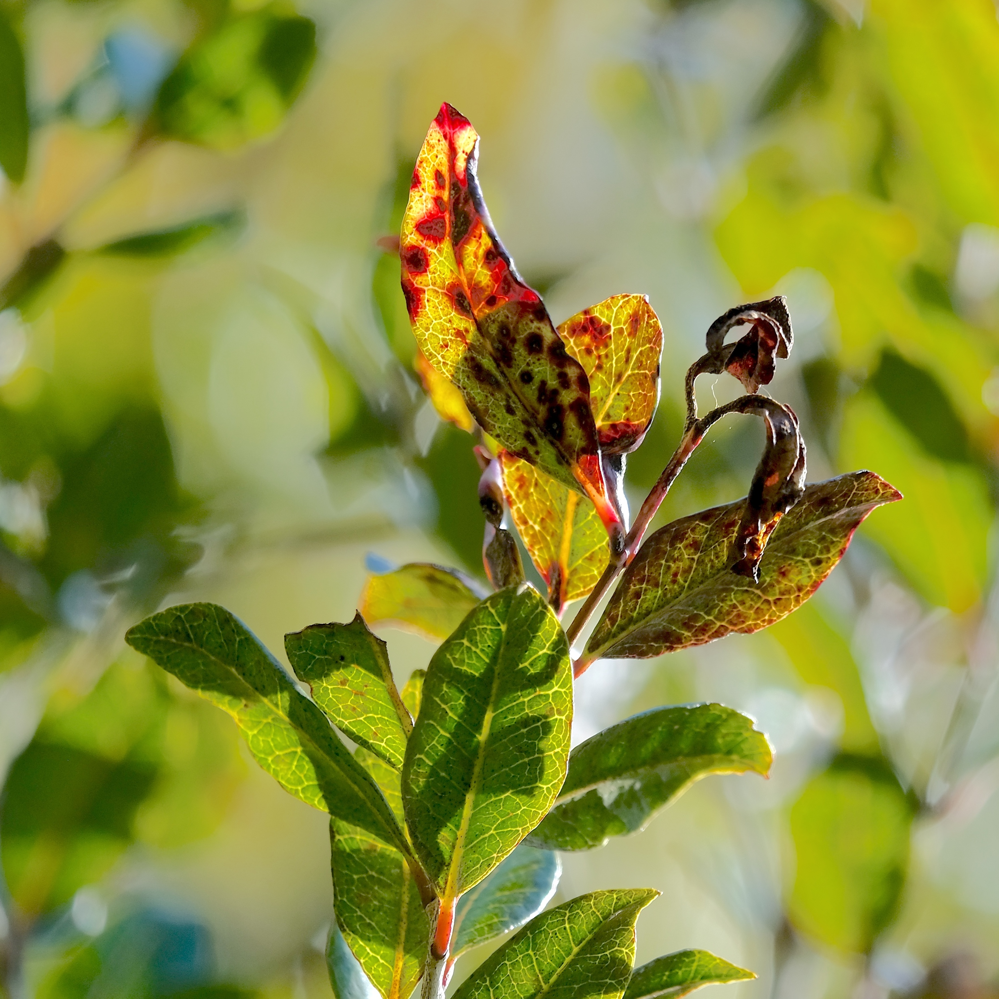

# Literature Review

## Plant-level Symptoms of Myrtle Rust

 spores infect the host-plant only on actively growing tissue like young shoots, developing leaves and fruits [@boufleurDiagnosticGuide2023; @glenPucciniapsidii2007; @chockglobalthreat2020]. After germination and a latent period of approximately two weeks, the symptoms start to show (@fig-symptoms; Beresford et al., 2020). Initially, the growing uredinial spores form yellow pustules (@fig-pustules). These growth areas turn into red blotches on leaves, killing the photosynthetic tissue and preventing the growth of new meristematic tissue, leading to the death of shoot tips (@fig-red_blotches) and flowers. Sustained infection ultimately leads to substantial defoliation [@boufleurDiagnosticGuide2023]. Hence, infection hinders the host to produce new photosynthetic tissue and development of seeds, disrupting the reproductive cycle [@fenshamUnprecedentedextinction2021]. In severe cases, sustained tissue loss and inability to produce new seeds can render the host infertile, ultimately leading to mortality [@fenshamUnprecedentedextinction2021]. Even when seed production is not entirely suppressed and seedlings germinate, they are highly susceptible to infection, severely limiting regeneration [@fernandez-winzerDirectindirect2020]. Such reproduction failure has raised concerns that highly susceptible species may face extinction within a single generation [@fenshamUnprecedentedextinction2021; @carnegieImpactinvasive2016]. As a consequence, this may have cascading effects across trophic levels, impacting birds, insects, and other organisms that depend on these species as habitat or food [@sutherlandMonitoringAustropuccinia2020].


:::: {#fig-symptoms fig-scap="Myrtle rust symptoms on *S. maire*." fig-pos="H"}

::: {layout="[1,-0.05,1]"}
{#fig-pustules}

{#fig-red_blotches}
:::

The  symptoms showing the advancement of  infection on *S. maire*. Initial growth of yellow urediniospores on leaves (**a**), and necrotic lesions and shoot tip dieback (**b**).
::::

## Management and Mitigation Strategies

 is considered to be established in New Zealand since 2018, and efforts are focused on long-term mitigation [@ministryforprimaryindustriesNewapproach2020]. Current strategies are targeted at protecting susceptible species and reducing the rate of spread [@beresfordGuidemyrtle2025]. These include removal of infected plant parts, or entire plants with minimal disturbance, and disposal in a manner that minimises the risk of further spore dispersal. Where possible, pruning is recommended during cooler seasons to avoid stimulating new growth. Additionally, clothing and equipment should be disinfected between sites. Synthetic fungicides offer an additional option for reducing infection severity and have shown to be highly effective in treating  with low phytotoxicity [@beresfordRiskbasedfungicide2022; @chngPotentialdisease2019]. However, their effectiveness depends on regular application, making them costly and impractical for large-scale use [@sutherlandMonitoringAustropuccinia2020]. Nevertheless, fungicide treatment may be viable in cases where only a small number of trees require protection, provided that their exact locations are known. 

## Current Mapping of 

Currently,  is predominantly mapped using community science platforms like iNaturalist. While iNaturalist is increasingly recognised as a valuable tool in biodiversity research and used to develop  [@masoniNaturalistaccelerates2025], its data is inherently biased to areas with higher human activity and accessibility. Geurts et al. [-@geurtsTurningobservations2023] found that 94% of observations are within 1 km of roads, demonstrating the spatial bias of such opportunistic datasets. Additionally, local conservation groups, such as the [Kaipātiki Project](https://kaipatiki.org.nz/our-work/eskdale-reserve/) or Friends of Bushglen Reserve, maintain records of  locations within their management areas. These known populations can provide the basis for developing and validating automated detection methods. Beyond discovering novel stands, -based detection offers the advantage of automating repeated monitoring to track tree health, growth, and infection progression over time. Another approach consists of , in which a multifactorial  analysis is developed to identify their most probable habitat. Such a model already exists for the greater Wellington region for  [@herbertIdentifyingpotentially2025]. However, such models only predict the likelihood of occurrence, but not their exact location, which is critical for current management approaches for .

 has become a widely used tool for tree species identification [@changApplicationUAV2025; @zhongReviewTree2024] and represents a promising option to close the mapping gap for , which could be built on  outputs. However, applying these methods to  presents inherent challenges: the species' rarity makes gathering of reference data challenging, its morphological overlap with co-occurring species, such as pukatea and tawa, complicates identification, and the potential for climbing plants to establish within its canopy further obscures individual trees for detection on aerial imagery.

## Deep Learning for Species Mapping

Tree detection in aerial imagery has followed the broader computer vision trend toward  solutions [@lecunDeeplearning2015]. Even though still used [@boschDetecTreeTree2020; @malekEfficientFramework2014; @mirakiIndividualtree2021; @safonovaIndividualTree2021], conventional  methods, such as  or  that classify individual pixels independently, have been outperformed by  methods [@liuComparingfully2018], which can even outperform humans in some cases [@alzubaidiReviewdeep2021]. Many studies focus on tree segmentation as their primary objective: detecting individual trees regardless of species [@ballAccuratedelineation2023; @ganTreeCrown2023; @ulkuDeepSemantic2022]. Beyond this foundational step, a more advanced and challenging task involves species-level classification, where trees are identified and assigned to their respective species [@kattenbornConvolutionalNeural2019; @lobotorresApplyingFully2020; @briechleClassificationTree2020; @zhongIndividualTree2024]. To achieve this species-level accuracy, methodologies broadly fall into two categories: 2D-sensed architectures, such as , and 3D-sensed architectures for  point clouds. Both are widely used; however, because 2D approaches can draw on a broader range of data sources ( imagery,  imagery,  imagery) and are often more cost-effective to acquire, there is substantially more  research in  based on 2D-sensed than on 3D-sensed data (@fig-bibliostats; L. Zhong et al., 2024).

:::: {#fig-bibliostats fig-scap="Publications on grid- and point-based deep learning articles." fig-pos="H"}

::: {layout="[-0.1, 0.85, -0.1]"}

```{python}
import pandas as pd
import matplotlib.pyplot as plt

# Load the CSV files
raster_df = pd.read_csv('../2_1_figures/introduction/raster_dl.csv')
point_df = pd.read_csv('../2_1_figures/introduction/pointcloud_dl.csv')


# Merge and sort
merged_df = pd.merge(raster_df, point_df, on='Publication Year', suffixes=('_raster', '_point'))
merged_df = merged_df.sort_values(by='Publication Year')
merged_df = merged_df[merged_df['Publication Year'] >= 2015]

# Set font to Arial
plt.rcParams['font.family'] = 'Arial'

# Plot
plt.figure(figsize=(10, 6))
bar_width = 0.4
years = merged_df['Publication Year']
x = range(len(years))

# Bars on top of grid
raster_bars = plt.bar([i - bar_width/2 for i in x], merged_df['Count_raster'], width=bar_width,
                      color='#3a6b90ff', label='2D-sensed DL', zorder=3)
point_bars = plt.bar([i + bar_width/2 for i in x], merged_df['Count_point'], width=bar_width,
                     color='#6a974cff', label='3D-sensed DL', zorder=3)

for i in range(1, len(merged_df)):
    raster_prev = merged_df['Count_raster'].iloc[i - 1]
    raster_curr = merged_df['Count_raster'].iloc[i]
    point_prev = merged_df['Count_point'].iloc[i - 1]
    point_curr = merged_df['Count_point'].iloc[i]

    if raster_prev > 0:
        raster_pct = ((raster_curr - raster_prev) / raster_prev) * 100
        plt.text(i - 0.2, raster_curr + 30, f'+{raster_pct:.1f}%',
                 ha='center', va='bottom', rotation=90,
                 fontsize=11, color='#274963ff',
                 bbox=dict(facecolor='white', edgecolor='none', pad=2))
    if point_prev > 0:
        point_pct = ((point_curr - point_prev) / point_prev) * 100
        plt.text(i + 0.2, point_curr + 30, f'+{point_pct:.1f}%',
                 ha='center', va='bottom', rotation=90,
                 fontsize=11, color='#3a532aff',
                 bbox=dict(facecolor='white', edgecolor='none', pad=2))

plt.xlabel('Year', fontsize=14)
plt.ylabel('Count', fontsize=14)
plt.xticks(x, years, rotation=45, fontsize=10)
plt.yticks(fontsize=11)
plt.tick_params(axis='y', length=0)
plt.grid(axis='y', linestyle='--', alpha=0.7, zorder=0)
plt.legend(fontsize=14, frameon=False, loc='upper center', bbox_to_anchor=(0.2, 0.91), facecolor='white')
plt.gca().spines['top'].set_visible(False)
plt.gca().spines['right'].set_visible(False)
plt.gca().spines['left'].set_visible(False)
plt.gca().spines['bottom'].set_visible(False)
plt.tight_layout()
plt.show()
```

:::

Total count and percentage increase between successive years of peer-reviewed scientific articles in the field of  related to  from 2015 - 2025. Blue represents publications related to 2D-sensed and green to 3D-sensed data. Search terms can be found in Appendix B and were retrieved from OpenAlex [@priemOpenAlexfullyopen2022].
::::

The comparison matters because 2D methods are easier to scale; 3D methods exploit crown geometry and vertical context, but they need more preprocessing and tree isolation before inference. Neither line of work has fully resolved rare-species mapping in dense forest under severe class imbalance.

### 2D Semantic Segmentation

 were originally designed for whole-image classification tasks [@krizhevskyImageNetclassification2017] and have been applied by community science tools like iNaturalist, Flora Incognita, and Pl@ntNet to identify plant species from photographs [@waldchenAutomatedplant2018; @dyrmannPlantspecies2016]. These networks revolutionised object detection through their capacity to analyse image texture (contextual information from clusters of neighbouring pixels) rather than evaluating pixels in isolation [@cholletXceptionDeep2017]. They autonomously learn which textural patterns (such as leaf morphology or canopy characteristics) are relevant for distinguishing vegetation communities and species [@dyrmannPlantspecies2016]. In these architectures, sequential pooling operations aggregate feature maps to progressively coarser spatial scales, with the final layer indicating only whether distinct (species) features appear anywhere within the image, without preserving their spatial locations. This self-learning capacity provides substantial advantages in computational efficiency and automation, eliminating manual feature engineering required for traditional  [@maggioriHighResolutionAerial2017]. Combined with advances in high-resolution sensors,  currently transform vegetation mapping capabilities.

However, -based vegetation mapping demands more than whole-image classification can provide. For mapping applications, success depends not on detecting whether the target class exists, but on determining its precise spatial location throughout the imagery, requiring spatially-continuous, detailed classification across entire image extents [@kattenbornConvolutionalNeural2019].  address this limitation by retaining and reconstructing the spatial locations of contextual features through encoder-decoder structures. These networks extract contextual features whilst preserving spatial origin, enabling fine-grained, spatial segmentation at the original imagery resolution [@maggioriHighResolutionAerial2017; @ronnebergerUNetConvolutional2015].

U-Net, originally developed for biomedical image segmentation [@ronnebergerUNetConvolutional2015], has become a widely adopted  architecture for species detection in  [@freudenbergLargeScale2019; @lakeDeeplearning2022; @kattenbornConvolutionalNeural2019; @ulkuDeepSemantic2022; @zhangIdentifyingmapping2020; @wagnerUsingUnet2019]. The U-shaped encoder-decoder architecture progressively reduces spatial resolution whilst increasing feature channels, enabling efficient pixel-wise semantic classification. Although numerous  architectures exist, their performance tends to be comparable to U-Net's [@lobotorresApplyingFully2020]. In  approaches, imagery is predominantly used with traditional  methods such as , yet is barely employed in -based studies [@zhongReviewTree2024].

This is the main trade-off in the 2D literature: U-Net-style models restore the localisation that whole-image  lose, but most published successes still rely on relatively accessible targets or less severe class imbalance than this thesis faces.

### 3D Instance Segmentation and Point Cloud Processing

For 3D  data, specialised neural network architectures have been developed to process forest point clouds. These methods leverage the vertical dimension and 3D tree crown geometry to discriminate between species, offering complementary information to spectral approaches [@zhongIndividualTree2024; @henrichTreeLearndeep2024]. Two primary architectural approaches exist: voxel-based methods that convert point clouds into regular 3D grids suitable for convolutional operations [@lecigneExploringtrees2018; @xiangAutomatedforest2024], and point-based architectures such as PointNet++ that process raw point coordinates directly whilst preserving geometric detail [@Qipointnet2017]. Recent studies have demonstrated successful species identification across diverse forest types using these approaches [@briechleClassificationTree2020].

However, point cloud data presents unique preprocessing challenges compared to imagery. Unlike raster data where spatial dimensions are standardised through tile size, point clouds contain variable numbers of points depending on forest structure and acquisition parameters. For species-level classification, individual trees must first be isolated [@briechleClassificationTree2020]. This tree instance segmentation can be achieved through graph-based methods such as Treeiso [@xi3DGraphBased2022] or deep learning approaches like TreeLearn [@henrichTreeLearndeep2024]. Once individual trees are extracted, point counts must be normalised to provide consistent neural network inputs, either through voxelisation into fixed grid sizes or through resampling to a standard number of points per tree. These preprocessing requirements add complexity but enable the exploitation of 3D structural information to potentially use for species identification.

That preprocessing requirement is the key limitation:  adds structural information that helps separate similar crowns, but it also makes the workflow less straightforward to operationalise for repeated monitoring.

## Synthesis and Research Gap

A critical challenge for detecting rare species is severe class imbalance combined with limited training data. Most published studies report target classes comprising 30--50% of annotated pixels [@lobotorresApplyingFully2020], whereas rare species in complex, biodiverse forests present significantly different characteristics. These challenges create a substantial gap between studies on readily detectable species [@pearseDeepLearning2021] and operational requirements for rare species in complex ecosystems.  shares morphological similarities with co-occurring native species, possesses small leaves that are difficult to resolve at typical  flight altitudes, and is a rare and conservation-critical New Zealand tree species highly vulnerable to . Taken together, these factors make it an appropriate case study for testing whether current deep learning approaches can successfully map rare, morphologically inconspicuous species in complex forest environments.

The literature therefore suggests three unresolved issues relevant to this thesis: many studies are developed around comparatively detectable target classes and do not fully represent the imbalance and ambiguity of rare-species monitoring; 2D and 3D approaches each capture different information, but the literature does not yet clearly show which modality is more robust under dense, species-rich forest conditions; and existing studies rarely assess whether models trained on one site can generalise across other locations with different canopy structure and background complexity. These gaps motivate the thesis objective and the methods evaluated in the next chapter.