# Methodology

## Research Sites {#sec-research_sites}


The thesis was conducted in four urban parks in Auckland and Hamilton, New Zealand (@fig-overview). Site selection was guided by known occurrences of  as reported on [iNaturalist](https://inaturalist.nz/taxa/406378-Syzygium-maire) and by local conservation groups. Additional sites were scouted around Tauranga, Auckland and Hamilton but were not considered further due to limited presence (< five individuals) or complete or highly advanced mortality of . The final four sites were selected based on a minimum of five trees and an age range of approximately 20--60 years, ensuring cross-site comparability. 

 contributors under [ODbl](https://opendatacommons.org/licenses/odbl/) by [OSFM](https://osmfoundation.org/).](../2_1_figures/overview.png){#fig-overview fig-scap="Overview of research sites." fig-pos="H"}

The regrowth forest at all sites is classified as : Kahikatea, pukatea forest [@singersclassificationNew2014]. This forest type comprises a podocarp and broadleaved community dominated by kahikatea (*Dacrycarpus dacrydioides*) with scattered pukatea, kiekie and supplejack, and occasional rimu (*Dacrydium cupressinum*), tawa and , predominantly on organic and gley soils characterised by elevated water tables. The canopy consists of a dense, complex matrix of tree species, making visual identification of  challenging, especially given the similar appearance of co-occurring native trees. The sites are surrounded by residential housing, ranging from 2.5--40 ha (@tbl-overview), though  was only present in small portions of each site (@fig-sites_extent). On three sites (A1--A3),  is under fungicide spray management, whilst H1 is unmanaged (@tbl-overview; R. Beresford, personal communication, October 29, 2025).


| Name | Code | Num. | Fungicide | UAV-data | Area (ha) | Train (m^2^) | Test (m^2^) |
|---------------------|-------|-------|------------|--------------------------|----|-------|------|
| Eskdale Reserve    | A1   | 15   | 2023   | /,  (1+4) | 40   | 2,916 | 426 |
| Kauri Glen Res. | A2   | 17   | 2023   | /,  (1+2) | 21   | 1,667 | 306 |
| Bushglen Res.   | A3   | 23   | 2022   | /                          | 2.5  | 3,017 | 405 |
| Hammond Park       | H1   | 15   | No     | /                          | 6    | 1,428 | 324 |

: Summary of the research sites with  populations.  captures at Eskdale Reserve (A1) consisted of one nadir and four oblique flight legs, while those at Kauri Glen (A2) consisted of one nadir and two oblique flight legs. Number refers to the number of  canopies visible on aerial imagery. Area is for the entire forest within that park. Train refers to the area of the training zone and te
st to the area of the test zone (@fig-sites_extent). {#tbl-overview tbl-pos="H"}

:::: {#fig-sites_extent fig-scap="Extent of training and test-zones."}

::: {layout-ncol=2}
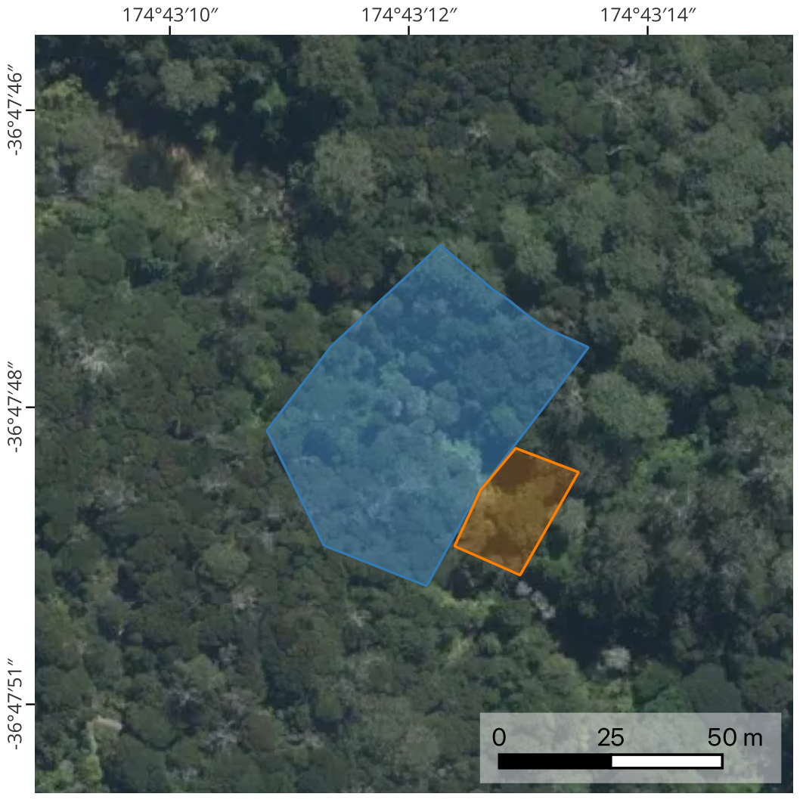{#fig-sites_extent_A1}

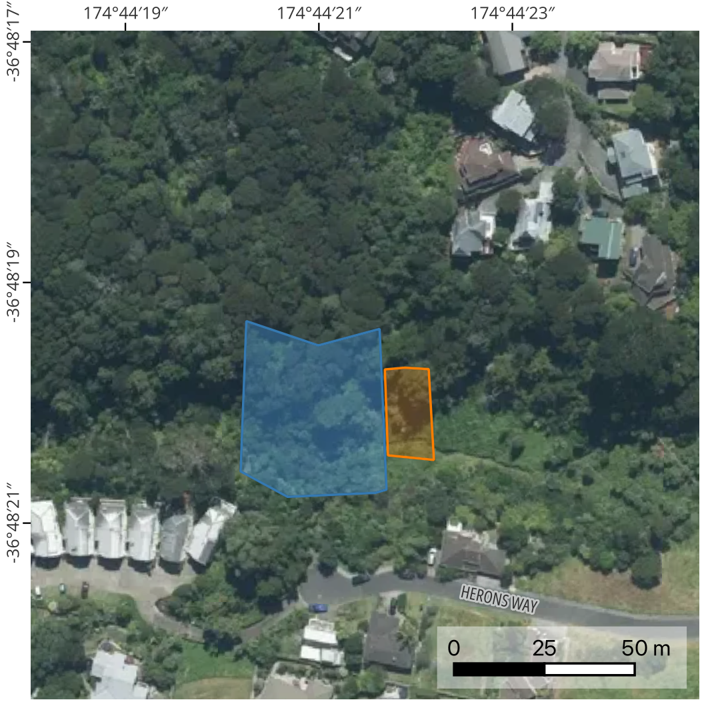{#fig-sites_extent_A2}

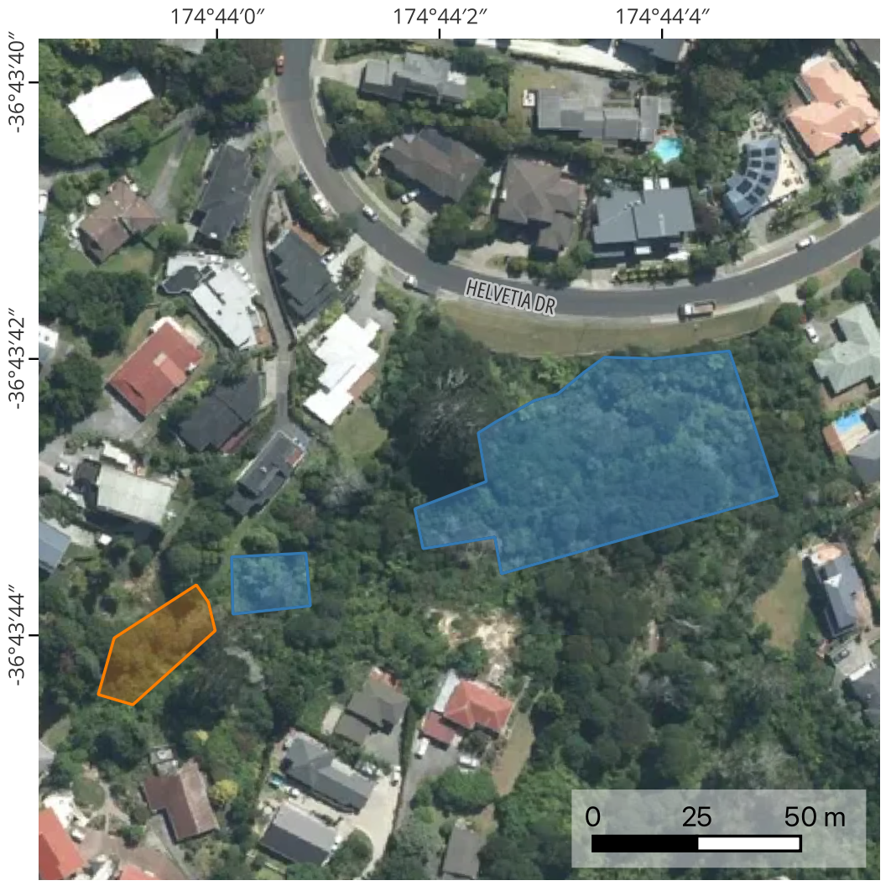{#fig-sites_extent_A3}

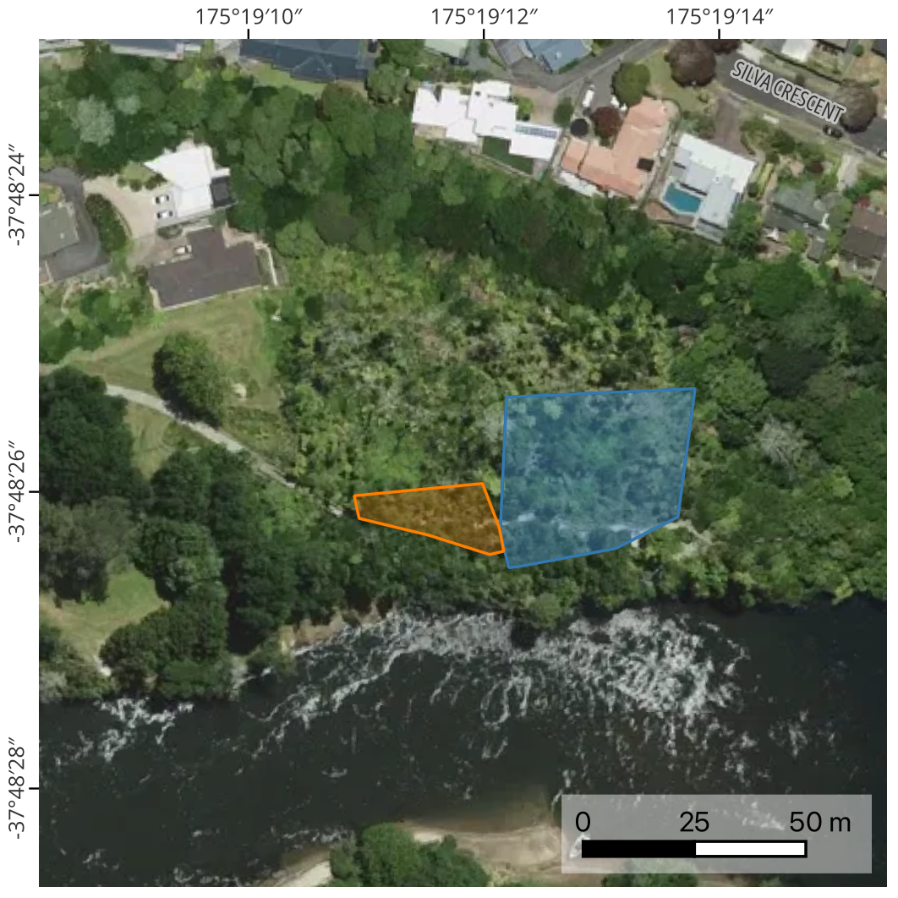{#fig-sites_extent_H1}
:::

Site extents showing training (blue) and test (orange) zones used for model evaluation; maps showing full park extent and surrounding area can be found in @sfig-sites_extent_overview. Site areas are listed in @tbl-overview. Basemap: Copyright LINZ aerial imagery under [CC BY 4.0](https://creativecommons.org/licenses/by/4.0/).
::::


## - and  Data Collection 

Flights were carried out with a   (@fig-M3M), equipped with a  visible imaging sensor (20 MP, 5280 × 3956) and a  imaging sensor (5 MP, 2592 × 1944) across four spectral bands: green (560±16 nm), red (650±16 nm), red edge (730±16 nm), and near-infrared (860±26 nm). Initial  imagery and  imagery captures were conducted in April 2025 but had to be repeated due to variable lighting conditions, resulting in poor data quality (@sfig-ms_seamline). Final  imagery and  imagery were acquired on 19 September (A1--A3) and 20 September (H1) 2025. 

All flights were carried out under full sunlight with wind speeds below 6 m/s. To ensure optimal exposure, flights were conducted within two hours of solar noon [@robbinsNatureScanRGB2025]. Flight paths were automatically generated in DJI Pilot 2 [@djiDJIPilot], and the  system was connected to the nearest  base station from  to ensure high positional accuracy. Flight altitude was set to 50 m , based on a 1 m , corrected to the geoid [@linzNewZealand2025; @linzNZGeoid2012]. Forward and side overlap were set to 85%, and flight speed was specified at 3 m/s. These settings were chosen and adapted based on the recommendations in Heim et al. [-@heimMultispectralAerial2019]. As suggested by Olsson et al. [-@olssonRadiometricCorrection2021], a photo of a MicaSense RP03  was taken after takeoff and before landing with all other settings left at their defaults.


## - Data Collection

 flights were carried out on 22 May 2025 using a DJI Matrice 350 RTK [@djiMatrice350] equipped with a Zenmuse L2 sensor (@fig-Matrice350; DJI, n.d.-e). The Zenmuse L2 is a  sensor, which emits laser impulses and measures the time for the laser pulse to be reflected by obstacles (e.g. vegetation, buildings or the ground) and return to the sensor. The time is then converted to distance in the given direction, which results in a three-dimensional point cloud. Flight altitude was set to 60 m  at A1 and 70 m  at A2. The reduced flight height at site A1 was chosen to maintain operational safety margins with a co-occurring flight at this location. Each site included one nadir flight and four (A1) or two (A2) oblique flights at a 20° angle (@tbl-overview). This difference in oblique flights was due to operational limitations of carrying out flights in mixed urban-forest environment to avoid overflight of private properties and comply with regulations. Forward overlap was set to 80%, side overlap to 50%, and flight speed to 7 m/s. Five returns were recorded per pulse, and the scan mode was non-repetitive. The  setup mirrored that used for the / imagery flights. The point density was at 8630 points/m² for site A1 and 4116 points/m² for site A2. The main reason for the difference in point density is the number of oblique flights (@tbl-overview), which results in more overlapping flight paths and thus variable point density. Furthermore, site A2 had a section with more open swampy areas, meaning less vegetation and therefore further reduced point density.

:::: {#fig-UAV fig-scap="UAVs used for data collection." fig-pos="H"}

::: {layout="[1, -0.05, 1]"}
![The DJI Mavic 3 Multispectral  with the  and  sensors. Image: From wikimedia by *ZLEA* [-@zleaEnglishDJI2024]. CC-BY-SA-4.0.](../2_1_figures/method/M3M.jpeg){#fig-M3M}

{#fig-Matrice350}
:::

The two  used for / (**a**) and  (**b**) data collection.
::::

### Regulatory Compliance and Safety Considerations

-flights were conducted in accordance with  Part 101 operation rules and in compliance with relevant local regulations. Prior to each flight, operations were logged and approved via the [Airshare](https://pilot.airshare-utm.io/info) airspace management platform. This was required, since all sites were located within the control zone (CTR) airspace from Whenuapai Airport (A1-A3) or Hamilton Airport (H1). When operations were conducted within 4km of an aerodrome, approval was gained from all relevant aerdrome operators prior to any  flights (@fig-Airzone). For site A1, flight paths were planned to avoid overflight of sensitive areas, including a generous distance to a Horse paddock with animals present and the Glenfield cemetery at Eskdale Reserve (A1). 

:::: {#fig-Airzone fig-scap="Airspace considerations."}

::: {layout="[1, -0.05, 1]"}
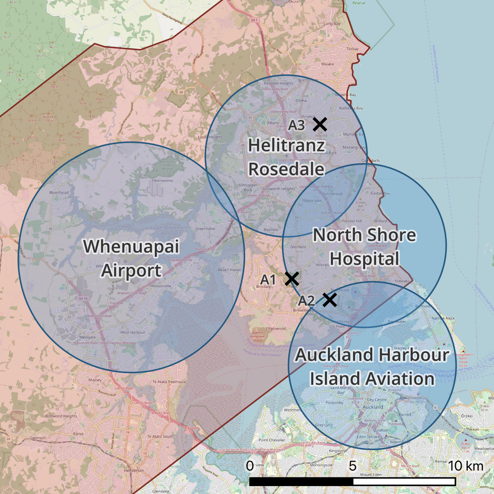{#fig-AKL_airzone}

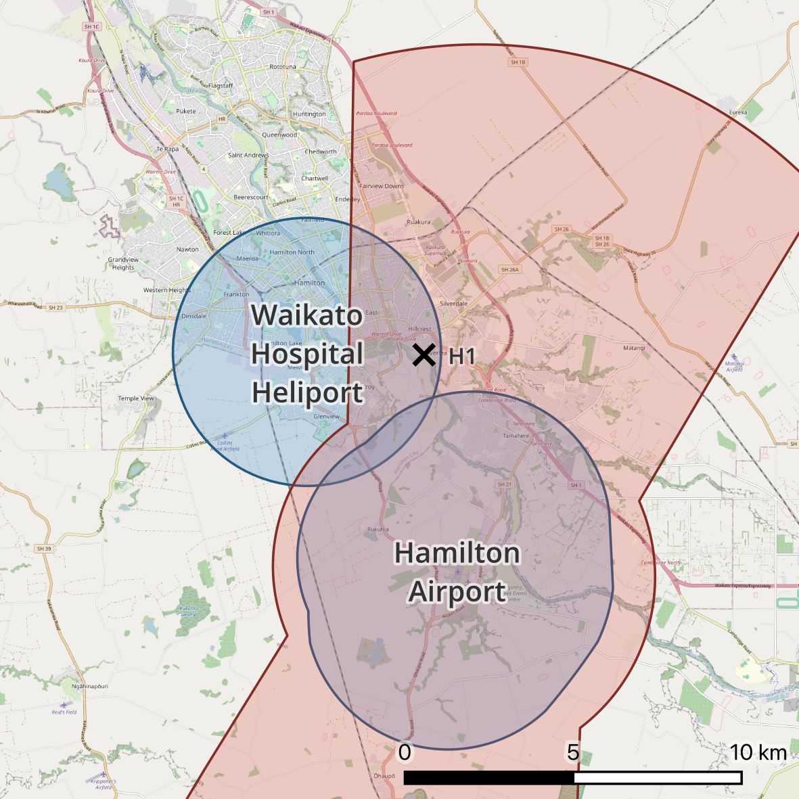{#fig-HAM_airzone}
:::

The maps for Auckland (**a**) and Hamilton (**b**) airspaces. Blue area shows zones within 4km of an aerodrome and red are Control Zones. Black crosses indicate research sites. All airspace boundaries are approximations based on data from the New Zealand Aeronautical Information Package (AIP) issued 25 December 2025. Basemap: Copyright [OpenStreetMap](https://www.openstreetmap.org) contributors under [ODbl](https://opendatacommons.org/licenses/odbl/) by [OSFM](https://osmfoundation.org/).
::::


Landownership requirements were verified for all sites. As all locations were on council-managed land (Auckland Council for A1--A3, Hamilton City Council for H1), formal consent was not required [@aucklandcouncilWhereyou; @hamiltoncitycouncilFlyingdrone], except for one privately owned property boundary at Bushglen Reserve (A3), for which verbal consent was obtained. A briefed observer was present during all flight operations to maintain situational awareness and ensure safe operations in these urban environments.

## Reference Data Collection

Ground-truthing of  on sites A2 and A3 was carried out on 10 May and 14 June 2025 for site A1.  locations were shown by volunteers from the local conservation group. To ensure exact positioning, the  was used and connected to the closest  base station. The receiver was then connected to QField [@qfield2024]. In the field, the receiver was positioned next to the trunk. Locations were only stored once the receiver had a confirmed accuracy of <30 cm. When travelling between sites, footwear was changed to reduce risk to spread  spores. Site H1 was not ground-truthed with the receiver. Since all trees, except two, were directly adjacent to the path, their rough locations were noted and later identified on the orthomosaic.

## Data Processing and Analysis

All data processing and analysis was performed using a combination of Python (v3.13.2), Agisoft Metashape [@agisoftllcAgisoftMetashape2025a], DJI Terra [@djiDJITerra] and CloudCompare [@cloudcompareCloudCompareVersion2022]. Computations were carried out on a workstation with a 13th Gen Intel® Core™ i7-13700 CPU, NVIDIA GeForce RTX 4070 Ti GPU, and 128 GB RAM running Windows 11. The following sections describe the data preprocessing, training and inference workflow in detail. The source code of this thesis is available on [github.com/pfaffrob/MSc_Thesis_RP](github.com/pfaffrob/MSc_Thesis_RP).

### Orthomosaic

 and  orthomosaics were generated from raw imagery in Agisoft Metashape, following workflows proposed by Geospatial Tips [-@geospatialtipsAgisoftMetashape2022], with some modifications for our data requirements. This process involved first calibrating reflectance and aligning of images, followed by iterative tiepoint filtering based on reconstruction uncertainty (<27), reprojection error (<0.83), and projection accuracy (>3.8), with alignment optimisation after each step. A dense point cloud was constructed and filtered by confidence (>2), which was then used to build a 2.5D surface (a point cloud which is triangulated into a mesh without overhang). The orthomosaics were exported at 2.5 cm/pixel resolution for  imagery and 1.5 cm/pixel for  imagery, with blending mode disabled (@fig-wf_orthomosaic). The blending mode was disabled to ensure that no smoothing or interpolation occurred during the orthomosaic generation process, and only raw image values were assigned to each pixel.

To enhance spectral discrimination, four normalised  were computed from the four-channel  orthomosaics (@tbl-indices) and stretched from float32 to uint16 format (-1--1 to 0--65535), which is a common approach to normalise data for  [@wagnerUsingUnet2019].  was calculated as a fundamental index sensitive to vegetation health and chlorophyll content.  utilises both   and  channels to detect vegetation stress and subtle canopy changes [@simsRelationshipsleaf2002].  applies a similar normalised difference approach but substitutes the  channel for , offering an alternative canopy response measurement [@briechleClassificationTree2020]. , derived from   and   channels, provides vegetation signal independent of . These indices were selected because they have shown potential for species identification where spectral signatures are needed due to limited morphological features [@barreroRGBmultispectral2018; @briechleClassificationTree2020]. 

Due to saturation of the  and  bands on the  photo (@sfig-crp_hist),  imagery and  were processed in two calibration schemes: absolute (using the sun sensor and ) and relative (using only the sun sensor; @tbl-band-combinations). Absolute calibration adjusts for exposure differences between sites, whilst relative calibration was retained to evaluate whether the burned  pixels (@sfig-crp_hist) used for radiometric calibration influenced model performance. A burned pixel means that it is assigned the maximum value (65535 in uint16 format), which means that the pixel value does not represent the true reflectance of the surface, but rather the maximum value that the sensor can record with the specified exposure settings (@sfig-exposure).


| Index Formula                  | Source            |
|:------------------------------:|-------------------|
|  $= \dfrac{NIR - R}{NIR + R}$      | @rousejrMonitoringvegetation1974 |
|                                |                   |
|  $= \dfrac{NIR - RE}{NIR + RE}$  |  @gitelsonSpectralReflectance1994 |
|                                |                   |
|  $= \dfrac{RE - R}{RE + R}$       | @briechleClassificationTree2020  |
|                                |                   |
|  $= \dfrac{G - R}{G + R}$         | @tuckerRedphotographic1979       |

: The formulas for the  used in this thesis. {#tbl-indices tbl-pos="H"}


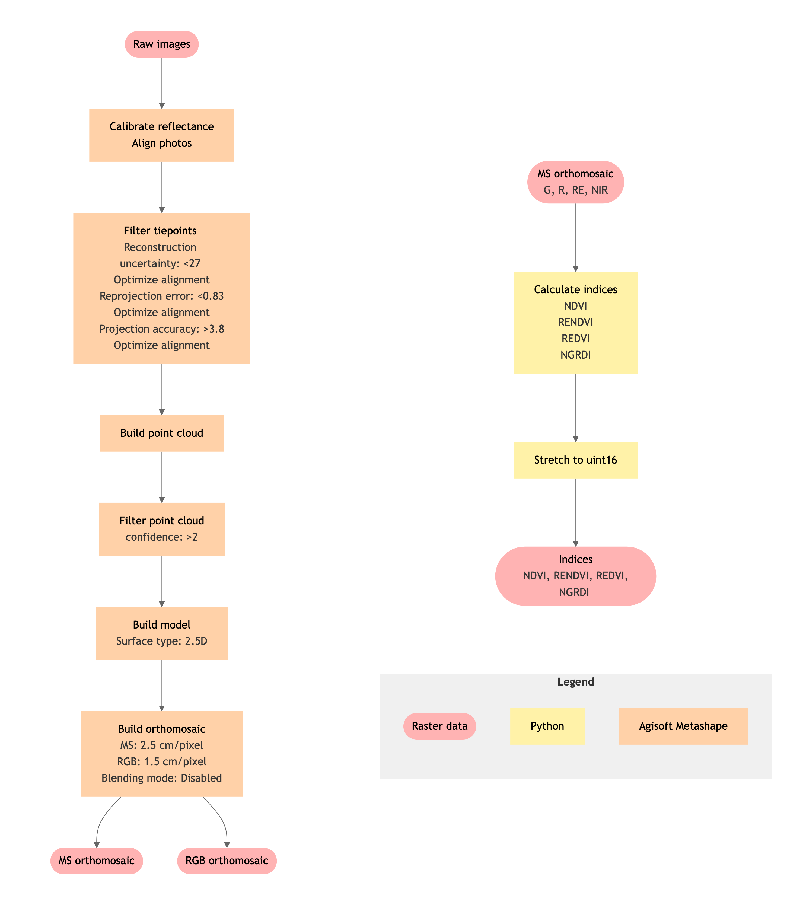{#fig-wf_orthomosaic fig-scap="Orthomosaic generation workflow." fig-pos="H"}


### U-Net

#### Annotation

Ground-truthed  locations were overlaid on the orthomosaics. The annotator first examined unambiguous  individuals to establish their characteristic visual appearance. Using this visual knowledge base, the visible canopy of each  instance was digitised, which included more complex cases such as where visible canopy was offset from the ground-truth point (e.g., due to trunk angle; @fig-label_offset_overgrowth) or growth of other vegetation within canopy (@fig-label_other_vegetation). Given the limited training samples, dead foliage was excluded (@fig-label_dead) to keep the training data as uniform as possible and reduce within-class variability. Furthermore,  present at ground-truth points but with no visible canopy were not annotated (@fig-label_offset_overgrowth). Where canopy crowns were segmented by overlapping vegetation or shadowed/poorly lighted, only areas clearly identifiable as  were digitised, which could result in fragmented annotation polygons (@fig-label_other_vegetation). To account for processing differences and geometric offsets between sensors,  and  imagery were annotated independently. Following digitisation, annotation polygons were rasterised to match orthomosaic resolution.

:::: {#fig-digitisation_examples fig-scap="Annotation examples."}

::: {layout="[1,-0.05,1][1,-0.05,1]"}
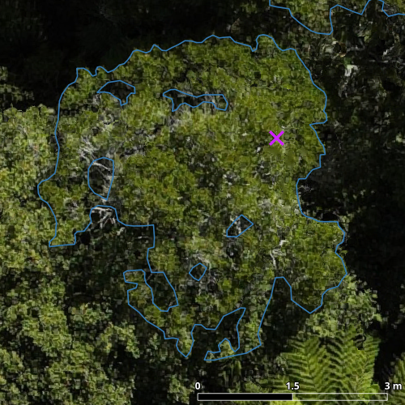{#fig-label_typical}

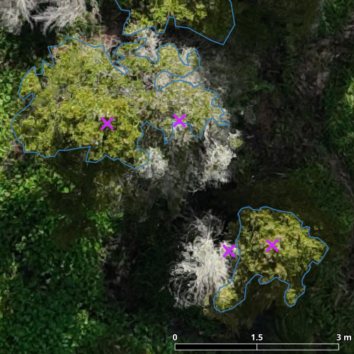{#fig-label_dead}

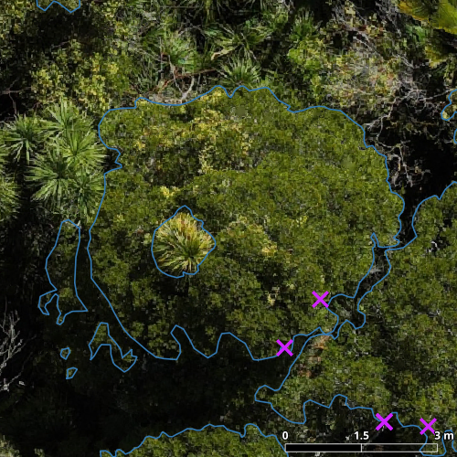{#fig-label_other_vegetation}

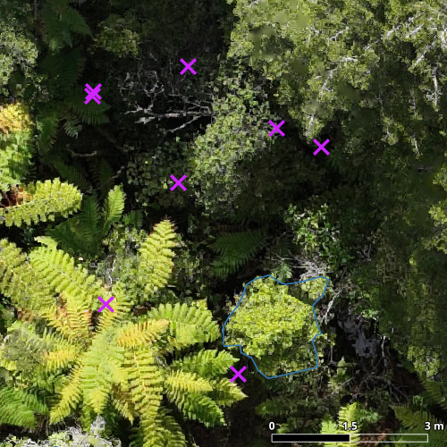{#fig-label_offset_overgrowth}
:::

Examples of  canopy annotation: (**a**) typical crown, (**b**) canopy offset from the ground-truth position with adjacent overgrowth, (**c**) dead canopy excluded from annotation, and (**d**) fragmented annotation where other vegetation grows within the crown. Annotation polygons are shown in blue and ground-truth points as in pink.
::::

#### Dataset Generation

In , the optimisation of model weights is based on the training data, while validation data is used during training to monitor model performance on independent data and prevent overfitting. Test data, in contrast, is used only for final performance evaluation, ensuring an unbiased assessment of how the model performs on unseen data [@ianDeepLearning2016]. Therefore, to evaluate model performance, training, validation, and test data must be separated carefully. This subset is also required because the U-Net model cannot process these full-resolution orthomosaics directly due to memory and computational constraints, and must therefore be further divided into smaller chunks. In geospatial applications, the partitioning is critical with tiling frameworks where adjacent image tiles overlap and share boundary pixels. If training and test data were derived from overlapping tiles within the same area, performance metrics would be artificially inflated because the model would have effectively "seen" the test data during training [@kattenbornSpatiallyautocorrelated2022].

To avoid this bias, orthomosaics were cropped into two spatially separated areas with zero overlap: a training zone and a test zone (@tbl-overview; @fig-sites_extent). Following the tiling framework by Chen et al. [-@chenMultiInputChannel2024], train and test zones were clipped into 576x576 pixel tiles with 25% overlap. The tiles of the training zone were then further separated into a 80/20 train/validation split [@kattenbornConvolutionalNeural2019]. The selection was not fully random to ensure similar proportion of  pixels in both subsets. The resulting dataset exhibited severe class imbalance, with  representing 3.4±0.7% (mean±SE) of pixels in training tiles and 4.9 ± 0.5% in validation tiles (@stbl-class_distribution). Datasets with seven band combinations were created to assess their relative performance (@tbl-band-combinations).


| Band Type  | Bands             | Description          | 
|------------|-------------------|----------------------|
| RGB        |    | Standard RGB channels |
| MS$_{rel}$         | , , ,  |  with relative calibration |
| MS$_{abs}$        | , , ,  |  with absolute calibration |
| IND$_{rel}$        | , , ,   | Vegetation indices |
| IND$_{abs}$        | , , ,   | Vegetation indices |
| MS+IND$_{rel}$  | , , , ,  | MS$_{rel}$ + $_{rel}$  |
| MS+IND$_{abs}$  | , , , ,  | MS$_{abs}$ + $_{abs}$  |

: Band combinations used for training with mirroring relative and absolute combination for  bands. {#tbl-band-combinations tbl-pos="H"}


#### Data Augmentation

To improve model generalisation and mitigate the drawbacks of limited training data, the dataset was artificially expanded by augmenting the image tiles using Albumentations [@buslaevAlbumentationsFast2020]. Augmentations included horizontal and vertical flips (probability 0.5), geometric transformations via ShiftScaleRotate with ±10% translation, ±15% scale, and ±45° rotation (probability 0.5), grid distortion to handle terrain and canopy variations (probability 0.2), and multiplicative noise to simulate illumination changes (multipliers 0.95–1.05, probability 0.2). This approach applied only n-channel-safe augmentations whilst creating substantial variation in training samples.

#### Architecture

The U-Net  architecture was selected for semantic segmentation based on its established efficacy in  applications for vegetation detection [@freudenbergLargeScale2019; @shahiDeepLearningBased2023; @kattenbornConvolutionalNeural2019; @abreu-diasAdvancesAutomated2025; @lobotorresApplyingFully2020]. The model follows an encoder-decoder structure with skip connections [@ronnebergerUNetConvolutional2015]. In the contracting path, two 3×3 convolutions followed by a  activation are applied, then a 2×2 max pooling operation with stride 2 downsamples by halving spatial resolution whilst doubling feature channels. This pattern repeats through four encoder blocks. The expanding path mirrors this: a 2×2 transposed convolution upsamples the feature map and halves the channels, and is merged with its corresponding feature map from the contracting path through skip connections that preserve spatial detail. Two 3×3 convolutions and  activations follow, continuously reconstructing spatial resolution. A final 1×1 convolution maps each feature vector to output classes, producing the segmentation map. The architecture is displayed in @fig-unet.

The implementation was adjusted by adding zero-padding to the 3×3 conv/ blocks to retain input-to-output spatial resolution, eliminating the cropping required in the original design and simplifying inference post-processing. Whilst zero-padding could introduce artefacts at tile boundaries [@huangTilingstitching2019], this was not observed with the applied tiling approach. Therefore, other options, such as using a buffer for predictions which is clipped post-processing [@ballAccuratedelineation2023; @freudenbergLargeScale2019], were not further explored. The model was implemented in PyTorch [@paszkePyTorchImperative2019] and core functionalities used from Pfaff [-@pfaffPrivetdetectionunpublished].

::: {#fig-unet fig-scap="U-Net architecture."}

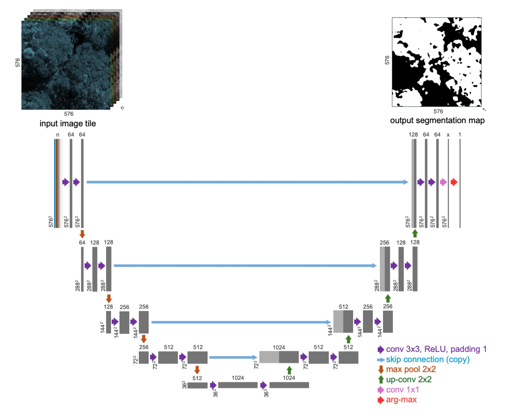

U-Net architecture which accepts n-channels input image of 576×576 pixels. Each grey box represents a multichannel feature map. Channel numbers are shown on top of each box, with spatial resolution indicated at the lower left. Light grey boxes display feature map copies, and arrows represent the various operations.
:::

#### Loss Functions

Selection of a suitable loss function is critical for training a  model [@azadLossFunctions2023]. The loss function calculates the error between the annotation mask and the predicted output, thereby guiding the optimisation of network weights during training. Various loss functions are used in binary semantic segmentation to address different challenges, such as the class imbalanced present in this study (target class representing only 3.4±0.7% (mean±SE) of pixels; @stbl-class_distribution). Such a class imbalance has been identified as a crucial factor influencing  model performance [@ghoshclassimbalance2024]. Selecting a loss function which applies class weighting is a common mitigation strategy [@bourdayComparativeStudy2024]. Given the importance of this selection, three loss functions were evaluated:  with class weights of 1, 10, and 50; unweighted  loss; and , a combination of the two, which has shown good results in imbalanced binary segmentation tasks [@koishiyevaAnalysisLoss2025].

In the following formulations, $y^{(i)}$ denotes the ground-truth label for pixel $i$ (0 = background, 1 = target class). The model's predicted probability for that pixel is represented by $\hat{y}^{(i)}$. Additionally, $N$ indicates the total number of pixels, and $\beta$ is the weight assigned to the target class.

 adjusts the standard binary cross-entropy loss by applying a target class-specific weight ($\beta$), increasing the penalty for misclassifying minority class pixels [@liCombinedLossBased2022]:

$$
L_{WBCE} = - \sum_{i=0}^{N} \beta\, y^{(i)} \log\hat{y}^{(i)}
+ \big(1 - y^{(i)}\big)\, \log\big(1 - \hat{y}^{(i)}\big)
$$ {#eq-WBCE}

 is a region-based overlap optimisation loss function that is less sensitive to class imbalance, as it directly optimises the overlap between predicted and ground-truthed regions:

$$
L_{Dice} = 1 - \frac{2\, y^{(i)} \hat{y}^{(i)}}{y^{(i)} + \hat{y}^{(i)}}
$$ {#eq-Dice}

 The combined  loss function balances pixel-wise accuracy with region overlap optimisation [@liCombinedLossBased2022]:

$$
L_{C} = L_{WBCE} + L_{Dice}
$$ {#eq-WBCE_D}


#### Training Configuration

Separate models were trained on each site independently (single-site) and on all sites combined (multi-site). The main limitation of site-specific models is that they cannot be deployed to new locations. This means that either a new model must be trained for each location (requiring time-expensive ground-truthing and re-annotation, defeating the purpose of a method aimed at identification of unknown  locations), or a single model must be developed that generalises across sites. Therefore, a single model was trained on combined data from all four sites to assess whether comparable or better performance could be achieved relative to site-specific models.

For model training,  optimisation with initial  of 0.02 or 5×10^-5^ were used. A ReduceLROnPlateau scheduler monitored target class  on the validation split, reducing the  by a factor of 0.5 after 15 epochs without improvement [@srivastavaAdvancingMultiClass2024]. Training ran for a maximum of 300 epochs with batch size of 2 and early stopping after 20 epochs without improvement in training loss. The best-performing model (by highest  on the validation dataset) was used for subsequent inference.

For single-site models, all combinations of  (0.02, 5×10^-5^), class weights (1, 10, 50), loss functions (Dice, , ), and band combinations (MS$_{rel}$, RGB) were evaluated individually on each reserve. For the remaining band combinations, base hyperparameters were used (weight=10, =0.02, loss=), resulting in 120 single-site models.

For multi-site models trained on all available training data,  was set to 0.02. Three hyperparameter combinations were tested across five band combinations (MS$_{abs}$, MS$_{rel}$, MS$_{abs}$ + RENDVI, IND$_{abs}$, ), with unweighted ,  with weights 10 and 50, resulting in 15 multi-site models.


#### Inference and Evaluation

Predictions were generated by applying identical preprocessing steps as applied to the training zone (@fig-sites_extent) and running the trained model in inference mode. Predicted tiles were stitched back into a single orthomosaic, combining overlapping regions. In the stitching process, any pixel predicted as target class was retained as target class in the final output.

Model performance was evaluated on the spatially separated test zone (@fig-sites_extent) to ensure metrics reflected unseen data. The following evaluation metrics were calculated exclusively for the target class. Precision, which measures the proportion of correctly predicted target pixels among all pixels predicted as target:

$$
\text{precision} = \frac{\text{TP}}{\text{TP} + \text{FP}}
$$ {#eq-precision}

where TP is true positives and FP is false positives. Recall measures the proportion of correctly predicted target pixels among all actual target pixels:

$$
\text{recall} = \frac{\text{TP}}{\text{TP} + \text{FN}}
$$ {#eq-recall}

where FN is false negatives. The primary aggregating metric was , the harmonic mean of precision and recall:

$$
\text{F1} = 2 \times \frac{\text{precision} \times \text{recall}}{\text{precision} + \text{recall}}
$$ {#eq-F1}

To assess whether additional  canopy area improves model performance, a Pearson correlation test was performed between annotated area of the training zones and  scores. The hypotheses were defined as $H_0$: increasing available  canopy area does not improve model performance (no linear relationship), and $H_1$: increasing available  canopy area improves model performance (positive linear relationship). A simple linear regression was also fitted to quantify the relationship.

## LiDAR Tree Segmentation

Two methods of  based tree segmentation were trialled to determine whether they could supplement the raster based  workflow: TreeLearn, which is -based [@henrichTreeLearndeep2024], and Treeiso, which is graph-based [@xi3DGraphBased2022]. Due to time constraints and preliminary assessment of segmentation results indicating challenges with segmentation accuracy (@fig-tree_instance_seg), these approaches were only assessed qualitatively to determine whether they are worth exploring further in future work. The following describes the processing steps undertaken, and the workflow is shown in @fig-wf_treeseg.

:::: {#fig-wf_treeseg fig-scap="LiDAR tree segmentation workflow."}

::: {}
```{mermaid}
%%| fig-width: 6.5
%%| file: ../2_1_figures/mermaid/treeseg.mmd
```

:::

Workflow to test the LiDAR tree segmentation methods (TreeLearn and Treeiso). This included point cloud processing, including the generation of a DTM, and application of the two segmentation methods.
::::

### Point Cloud Processing

Raw  data was processed to  files using DJI Terra. A 10cm  was generated from the point cloud to enable height normalisation. Point clouds were filtered to non-ground points and then normalised to ground level by subtracting the  elevation from each point's z-coordinate. This ensured the height above ground level of the represented vegetation structure rather than terrain elevation. For Treeiso segmentation, points lower than 1.5 m above the ground were removed to reduce noise from dense understory vegetation [@xi3DGraphBased2022].

### Segmentation Methods

Both TreeLearn and Treeiso algorithms were applied to segment individual tree crowns from the normalised point clouds. TreeLearn voxelises the point cloud by dividing the 3D space into small cubes (voxels) and assigning points to these cubes, then applying a  model to classify each voxel as belonging to a specific tree instance, effectively segmenting individual tree crowns based on learned spatial features and patterns in the point cloud data [@henrichTreeLearndeep2024]. In contrast, Treeiso employs a graph-based approach, treating the point cloud as a network of connected points where each point is a node and connections exist between nearby points. The algorithm identifies clusters or groups of connected points associated with the same tree crown by analysing the structural relationships and connectivity patterns between points [@xi3DGraphBased2022]. Segmentation outputs were visually assessed for accuracy by comparing segmented tree boundaries with canopy extents visible in orthomosaics (@fig-tree_instance_seg).
