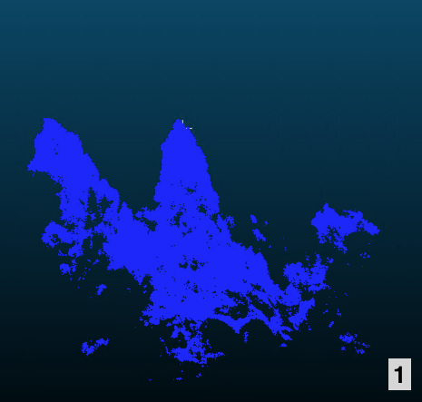
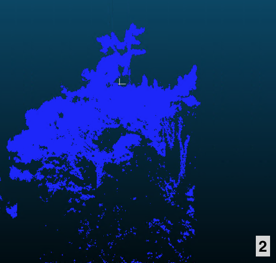
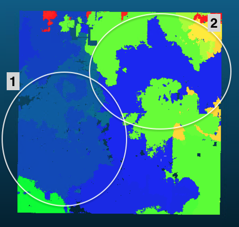
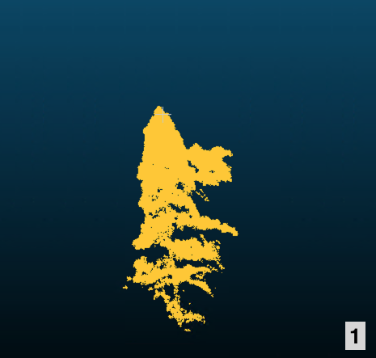
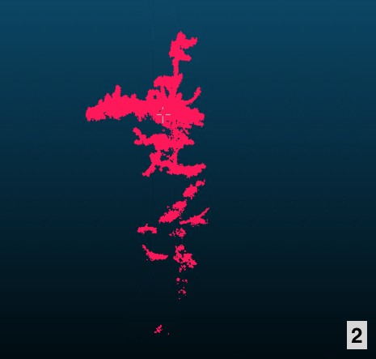
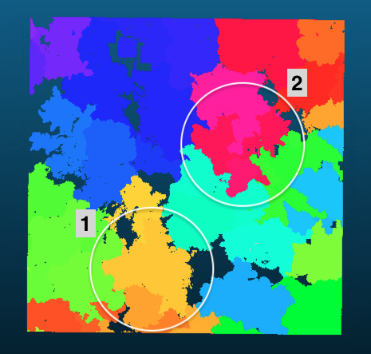

# Results

This section presents the outcomes of applying  methods to detect  using -based imagery and point cloud data. The analysis explored two key approaches: semantic segmentation of  and  imagery, and instance segmentation of  point clouds (@fig-wf_overall). The primary question was whether automated methods can reliably identify individual  canopy in dense native forests. This is a task with direct conservation implications, as accurate mapping of rare and threatened species such as  is essential for targeted management efforts against .

Detection of  was moderately successful using semantic segmentation. Under certain conditions, models demonstrated promising detection ( scores of 0.65–0.81 on favourable sites), though performance declined significantly with smaller training datasets (best =0.56) or when training across multiple sites simultaneously (best =0.51). While -based instance segmentation methods showed promise, both methods produced results that were not sufficient for inclusion within the workflows of this study. Below, we present detailed results from the semantic segmentation analysis, including investigation of hyperparameters, followed by a qualitative assessment of why the  approaches require further development.

## U-Net Semantic Segmentation

### Single-site

When trained on data from a single site, U-Net was able to detect  canopies with moderate to good performance. However, performance varied considerably between sites, with  scores ranging from 0.46 to 0.81. Amount of available training data significantly improved performance (Pearson p=0.017 and R^2^=0.996; @fig-linear_regression). A variety of model configurations and different band combinations were tested as input to identify the best performing configuration. The following sections present this optimisation work, followed by a section on the best models and how they performed on unseen data.

:::: {#fig-linear_regression fig-scap="Linear regression of annotated training area vs. F1 score."}

::: {layout="[-0.15, 0.7, -0.15]"}
```{python}
import os
import sys
import geopandas as gpd
import pandas as pd

# Make local plotting helper available
sys.path.insert(0, '../2_1_figures/results')
from linear_regression_plot import plot_annotation_area_vs_f1

# Access reserve paths for annotation areas
sys.path.insert(0, '../4_1_modules')
from config.paths import use

reserves = ['ESK', 'KAU', 'BUS', 'HAM']
best_f1_scores = {
    'ESK': 0.55,  # A1
    'KAU': 0.41,  # A2
    'BUS': 0.75,  # A3
    'HAM': 0.27   # H1
}

rows = []
for reserve_code in reserves:
    r = use([reserve_code])[0]
    gpkg_path = os.path.join(r.GIS, 'swamp_maire_poly.gpkg')
    train_zone = os.path.join(r.GIS, 'bbox.gpkg')
    gdf = gpd.read_file(gpkg_path, layer='maire_poly_rgb')
    train_gdf = gpd.read_file(train_zone, layer='unet_training_zone')
    gdf = gdf.clip(train_gdf)
    if gdf.crs and gdf.crs.is_geographic:
        gdf = gdf.to_crs('EPSG:2193')
    annotation_area = gdf.geometry.area.sum()
    rows.append({
        'Site': reserve_code,
        'Annotation_Area_m2': annotation_area,
        'Best_F1_Score': best_f1_scores[reserve_code]
    })

df = pd.DataFrame(rows)
plot_annotation_area_vs_f1(df)
```

:::

Linear regression of annotated  area (m^2^) within the training zone vs. F1 score trained on RGB imagery (@tbl-bands) for each site. Each point represents a site, and the regression line is shown in red with R^2^=0.966.
::::

#### Hyperparameter Configuration

To identify which configuration had the greatest impact on detection accuracy, three key hyperparameters were systematically tested: the loss function (which guides how the model learns), the  (which controls the magnitude of model weight adjustments during training), and class weights (which penalise misclassification of the underrepresented  class more heavily). This systematic comparison of hyperparameters (@tbl-hyperparams) revealed differences in model performance. 

 achieved the highest mean  scores (0.56±0.14 for  imagery, 0.54±0.25 for MS$_{rel}$), outperforming  (0.50±0.20 / 0.45±0.26) and  (0.48±0.27 / 0.46±0.17).  had the most substantial impact on performance. Models trained with an initial =0.02 outperformed those with =5×10^-5^. When using   scores dropped from 0.56±0.14 to 0.13±0.09 () and from 0.54±0.25 to 0.13±0.11 (MS$_{rel}$). The lower  produced random predictions with extremely high recall (up to 0.98) but negligible precision (0.07–0.14). This means that virtually any pixel was classified as  (@sfig-LR5e-5). Class weighting improved  performance:  gained with each incremental step adjusting the weights from 1 to 10 to 50 in both  and MS$_{rel}$ (@tbl-weight). However, the difference from 10 to 50 is marginal when visually inspecting results (@sfig-predictions_single_weight_comparison). 


::: {#tbl-hyperparams layout=[[1],[-0.3],[1],[-0.3],[1]]}

```{python}
#| label: tbl-loss
#| tbl-cap: "Results from tested loss functions (,  (no weight) and ) with weight=10 and =0.02."

import pandas as pd
import sys
sys.path.insert(0, '../2_1_figures/results')

csv_path='../2_1_figures/results/summary.csv'
df = pd.read_csv(csv_path)

from metrics import table_loss_function_comparison
table_loss_function_comparison(df)
```

```{python}
#| label: tbl-weight
#| tbl-cap: "Results from assigning weights 1, 10 and 50 for  class using ."

from metrics import table_weight_comparison
table_weight_comparison(df)
```

```{python}
#| label: tbl-lr
#| tbl-cap: "Results from initial  (0.02 and 5x10^-5^) in combination with a -scheduler with  using weight=10."

from metrics import table_learning_rate_comparison
table_learning_rate_comparison(df)
```

Comparison of hyperparameters on  detection performance (mean±std), tested on each site separately. Tested hyperparameters included loss function (**a**), class weight (**b**), and  (**c**). 
:::

#### Band Combinations

Using base hyperparameters (=0.02, weight=10, ),  imagery achieved the highest mean  score (0.50) across reserves, though, only marginally better than MS+IND$_{rel}$ (mean =0.48). However, this was not consistent across all sites. At sites A1 and H1,  band combinations outperformed  imagery: MS+IND$_{rel}$ achieved a notably high  of 0.64 on site A1. Performance varied substantially between the other sites: A3 showed the strongest and most consistent results across all band types (=0.60–0.75), whilst site A2 consistently showed poor performance (=0.08–0.41). Adding  to  bands did not consistently improve performance, except for site A1 where it contributed to the best result of that site (@tbl-bands).

```{python}
#| label: tbl-bands
#| tbl-cap: "F1 scores for tested band combinations (, MS$_{rel}$, IND$_{rel}$, MS+IND$_{rel}$) across reserves with =0.02, weight=10, and ."

from metrics import table_band_comparison_pivot
table_band_comparison_pivot(df)
```


The best-performing model, trained on site A3 with MS$_{rel}$ bands and  (weight=1, =0.02), achieved an  of 0.81 and  of 0.68 (@tbl-best_single; @stbl-best_models_single_site_ESK, S4, S5, S6). Training metric progression is shown in @sfig-train_metrics_best. Site A3 consistently produced the strongest results, with six of the top ten models from this reserve. Performance was more variable on other sites: A1 reached a maximum  of 0.65, H1 achieved 0.59, and A2 showed the lowest maximum  of 0.46. 

```{python}
#| label: tbl-best_single
#| tbl-cap: "Top 10 individual single-site models ranked by F1 score. The top 10 models for each site individually can be found in Table S2."

from metrics import table_top_individual_models
table_top_individual_models(df, top_n=10)
```

Visual inspection of the predictions reveals clear differences in model behaviour (@fig-predictions_single). Site A3 predictions show high correspondence with ground truth, especially for , which yielded cleaner edges, whereas  models produced frayed edges and additional noise. Site A2 predictions were consistently smaller than ground-truthed area. Site H1 showed the poorest performance, with consistent misclassified patches and additional noise.  with higher weights introduced more noise in both  and  imagery predictions compared to .


```{python}
#| label: fig-predictions_single
#| fig-cap: 'Predictions from the best-performing single-site models for the test zone for each reserve for a 15x15 m extent. Pink overlays indicate predictions on  imagery, yellow overlays on  imagery. Model configurations are listed on the left; all were trained with a  of 0.02. For example RGB-$L_{c}$-W10 reads as: "model trained on RGB bands using  with a weight of 10".'
#| fig-scap: Predictions single-site.

import pandas as pd
import sys
sys.path.insert(0, '../2_1_figures/results')

from predictions import plot_model_comparisons

models = [
    {'band_comb': 'ms_rel', 'lr': 0.02, 'loss': 'dice', 'weight': 1, 'label': r'MS$_{rel}$-$L_{Dice}$-W1'},
    {'band_comb': 'ms_rel', 'lr': 0.02, 'loss': 'bce_dice', 'weight': 10, 'label': r'MS$_{rel}$-$L_{c}$-W10'},
    {'band_comb': 'rgb', 'lr': 0.02, 'loss': 'dice', 'weight': 1, 'label': r'RGB-$L_{Dice}$-W1'},
    {'band_comb': 'rgb', 'lr': 0.02, 'loss': 'bce_dice', 'weight': 10, 'label': r'RGB-$L_{c}$-W10'},
]

# Generate comparison for all reserves
plot_model_comparisons(['ESK', 'KAU', 'BUS', 'HAM'], models, offset_x=[-1, 0, 0, 2], offset_y=[2, 0, 0, 1], figsize=(15,20))

```


### Multi-site

#### Band and Loss Functions

 bands outperformed  bands in the multi-site setting, with the three best models all using  imagery (@tbl-multi_site). This trend confirms the single-site results, however, the performance gap between  and  imagery is much more pronounced with =0.51 () and =0.35 ().

```{python}
#| label: tbl-multi_site
#| tbl-cap: "The performance metrics from the 10 best performing model configurations trained on the multi-site dataset, sorted by F1 score. A table with all models is available in @stbl-multi_site_all."

from metrics import table_multi_site_all
table_multi_site_all(df, max_rows=10)
```

Absolute-calibrated band combinations (MS$_{abs}$, IND$_{abs}$, MS+IND$_{abs}$) showed poor generalisation in multi-site training, with  scores ≤0.22 and subsequently also poor visual results (@fig-predictions-multisite).  on  imagery showed low noise but exhibited substantial under-segmentation and misclassification, where both sites A1 (=0.00) and A3 (=0.07) were subject to these issues. This was also visible in training metrics progression, where  plateaued after ~30 epochs (@sfig-train_metrics_multi_site).

#### Best-performing Multi-site Models

Despite systematic optimisation, multi-site models achieved substantially lower performance than single-site models. The best multi-site configuration ( imagery, , weight=50) achieved an  of 0.51 and  of 0.34, representing a 37% reduction in  compared to the best single-site model. Only the  imagery model with  achieved performance comparable to some single-site models (=0.54). Across all configurations, multi-site predictions were notably noisier than their single-site counterparts (@fig-predictions-multisite), indicating that the model struggled to learn consistent  characteristics across different forest structures and lighting conditions. Notably, visually one of the best results was on a site (A2) that showed poor results in the single-site setting, identifying  accurately (RGB, $L_{c}$, weight=50; =0.54; @fig-predictions-multisite).

```{python}
#| label: fig-predictions-multisite
#| fig-cap: 'Predictions from the best-performing multi-site models for the test zone for each reserve for a 15x15 m extent. Pink overlays indicate predictions on  imagery, yellow overlays on  imagery. Model configurations are listed on the left; all models were trained with a  of 0.02. For example RGB-$L_{c}$-W50 reads as: "model trained on RGB bands using  with a weight of 50".'
#| fig-scap: "Predictions multi-site."
#| fig-pos: 'H'

import pandas as pd
import sys
sys.path.insert(0, '../2_1_figures/results')

from predictions import plot_model_comparisons

models = [
    {'band_comb': 'ms_abs', 'lr': 0.02, 'loss': 'bce_dice', 'weight': 50, 'label': r'MS$_{abs}$-$L_{c}$-W50', 
     'multisite': ['KAU', 'ESK', 'BUS', 'HAM']},
    {'band_comb': 'ms_rel', 'lr': 0.02, 'loss': 'bce_dice', 'weight': 50, 'label': r'MS$_{rel}$-$L_{c}$-W50', 
     'multisite': ['KAU', 'ESK', 'BUS', 'HAM']},
    {'band_comb': 'ms_rel', 'lr': 0.02, 'loss': 'dice', 'weight': 1, 'label': r'MS$_{rel}$-$L_{Dice}$-W1', 
     'multisite': ['KAU', 'ESK', 'BUS', 'HAM']},
    {'band_comb': 'rgb', 'lr': 0.02, 'loss': 'bce_dice', 'weight': 50, 'label': r'RGB-$L_{c}$-W50', 
     'multisite': ['KAU', 'ESK', 'BUS', 'HAM']},
]

# Generate comparison for all reserves
plot_model_comparisons(['ESK', 'KAU', 'BUS', 'HAM'], models, offset_x=[-1, 0, 0, 2], offset_y=[2, 0, 0, 1], figsize=(15, 20))

```


## LiDAR Tree Segmentation

Two instance segmentation algorithms (TreeLearn and Treeiso) were tested to isolate individual tree point clouds from the forest point cloud. However, qualitative assessment of the two trialled segmentation methods revealed significant challenges with both approaches.

TreeLearn did not successfully segment individual trees and produced messy, near random looking segmentations (@fig-tree_instance_seg a-c). Treeiso performed better, producing recognisable tree segments, but segmentations frequently included portions of adjacent tree crowns, limiting their quality for species-specific classification (@fig-tree_instance_seg d-f). Given these limitations and the more promising results from  imagery analysis, further development of -based segmentation was not pursued within the timeframe of this thesis.

:::: {#fig-tree_instance_seg fig-scap='TreeLearn vs. Treeiso.'}

::: {layout="[1,-0.03,1,-0.03,1][1,-0.03,1,-0.03,1]"}

{#fig-a}

{#fig-b}

{#fig-c}

{#fig-d}

{#fig-e}

{#fig-f}
:::

Comparison between extracted segmentation groups using TreeLearn (**a**--**c**) and Treeiso (**d**--**f**).
::::