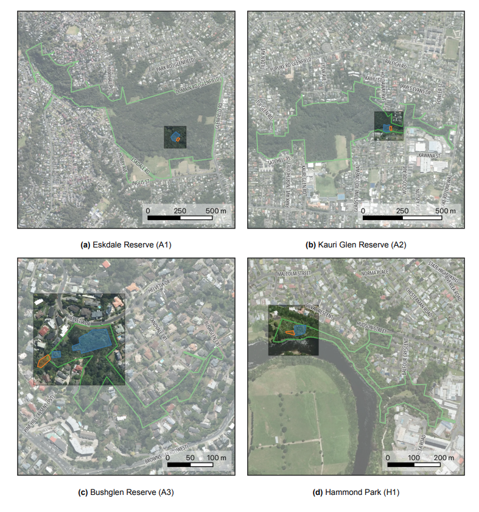
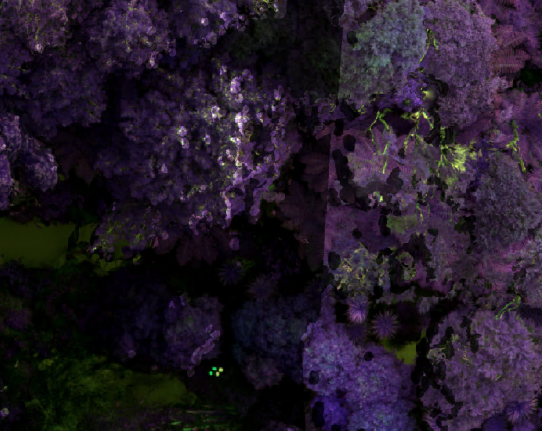
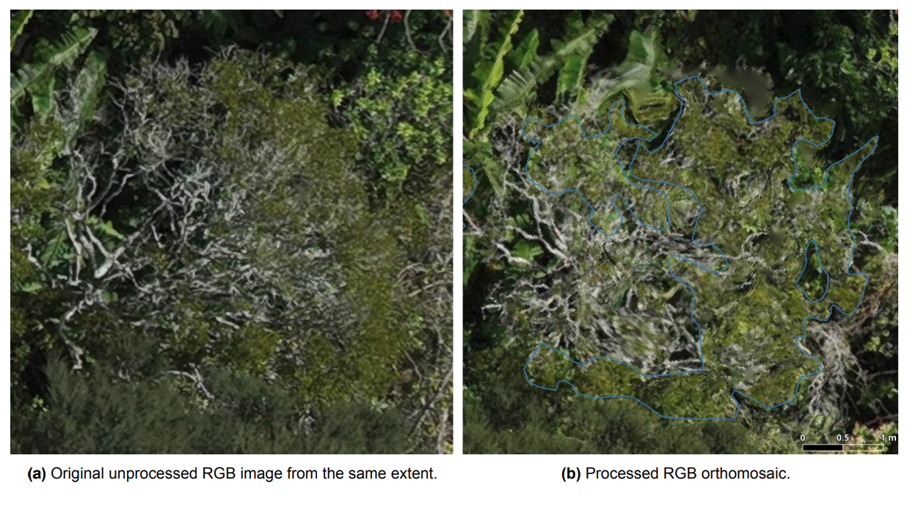
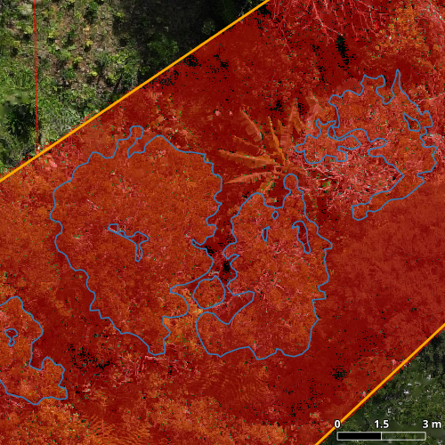
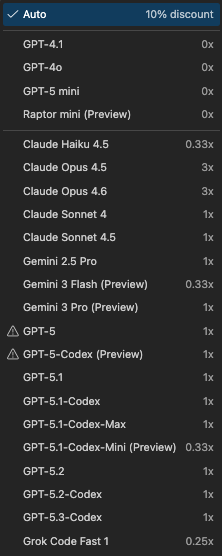
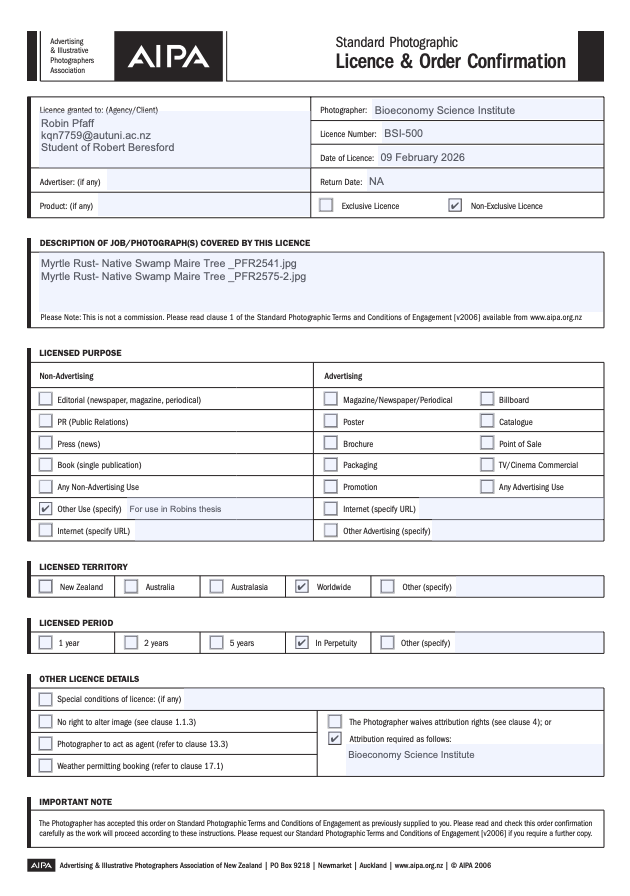

# Appendix A: List of Acronyms {.unnumbered}






# Appendix B: Supplemental Materials {.unnumbered}

## Search Terms {#sec-search_terms .unnumbered .unlisted}

### Grid DL {.unnumbered .unlisted}

("deep learning" OR "deep neural network" OR "CNN" OR "convolutional neural network") AND ("remote sensing" OR "GIS" OR "geospatial" OR "earth observation" OR "EO" OR "mapping" OR "environmental monitoring") AND ("satellite" OR "aerial" OR "UAV" OR "UAS" OR "drone" OR "multispectral" OR "MS" OR "hyperspectral" OR "HS" OR "RGB")

### Point-DL {.unnumbered .unlisted}

("deep learning" OR "deep neural network" OR "neural network" OR "geometric deep learning" OR "3D deep learning" OR "point-based network" OR "PointNet" OR "PointNet++" OR "PointCNN" OR "DGCNN" OR "Graph Neural Network" OR "PointTransformer") AND ("remote sensing" OR "GIS" OR "geospatial" OR "earth observation" OR "EO" OR "mapping" OR "environmental monitoring") AND ("point cloud" OR "pointcloud" OR "LiDAR" OR "lidar" OR "light detection and ranging" OR "3D data" OR "3D point cloud" OR "laser scanning" OR "ALS" OR "TLS")


## Site Extent Inset Maps {#sec-site_extent .unnumbered .unlisted}

::: {#sfig-sites_extent_overview sfig-pos=H}



Inset maps showing the location of the maps of @fig-sites_extent. The map shows park extent (green), training (blue) and test (orange) zones used for model evaluation; site areas are listed in @tbl-overview. Basemap: LINZ aerial imagery under CC BY 4.0. Park extents: Auckland Council (A1–A3) and Waikato OneView (H1) under CC BY 4.0.

:::

## Multispectral Reflectance Calibration {.unnumbered .unlisted}


::: {#sfig-ms_seamline layout="[-0.1,0.8,-0.1]" sfig-pos=H}



Example of different reflectance on calibrated  imagery from preliminary flights in April, most likely caused by changing cloud coverage, leading to the decision to carry out flights again with more consistent exposure to ensure high-quality data.
:::


## Calibration Panel Histogram Analysis {.unnumbered .unlisted}

:::: {#sfig-crp_hist layout="[[-0.2, 1, -0.2], [1,-0.1, 1], [1,-0.1, 1]]" sfig-pos=H}

::: {}
```{python}
import rasterio
import matplotlib.pyplot as plt
from matplotlib.patches import Rectangle
import numpy as np
import warnings
from rasterio.errors import NotGeoreferencedWarning

# Suppress the specific warning
warnings.filterwarnings("ignore", category=NotGeoreferencedWarning)

def plot_histogram_region(image_path, region):
    """
    Plots the image with a rectangle overlay showing the selected region.
    
    Parameters:
    - image_path: Path to the TIFF image.
    - region: Tuple of (x_start, x_end, y_start, y_end) defining the bounding box.
    """
    # Open the image using rasterio
    with rasterio.open(image_path) as src:
        # Read the first band for visualization
        image = src.read(1)

    # Extract region coordinates
    x_start, x_end, y_start, y_end = region

    # Plot the image
    fig, ax = plt.subplots(figsize=(8, 8))
    ax.imshow(image, cmap='gray')
    rect = Rectangle((x_start, y_start), x_end - x_start, y_end - y_start,
                     linewidth=2, edgecolor='red', facecolor='none')
    ax.add_patch(rect)
    ax.set_title("Selected Histogram Region Overlay")
    plt.show()

def plot_histograms_with_xlim(tiff_path, region, band, xlim=(0, 65535)):
    """
    Plot histograms for each band in a TIFF file for a selected region with optional x-axis limits.
    Displays both a line plot and a bar plot (bins).

    Parameters:
    - tiff_path: Path to the TIFF file.
    - region: Tuple (x_start, x_end, y_start, y_end) defining the region of interest.
    - xlim: Tuple (xmin, xmax) to set x-axis limits for the histograms.
    """
    x_start, x_end, y_start, y_end = region

    # Open the TIFF file using rasterio
    with rasterio.open(tiff_path) as src:
        count = src.count  # Number of bands

        # Loop through each band and plot histogram for the selected region
        for band_index in range(1, count + 1):
            # Read the band data
            band_data = src.read(band_index)

            # Extract the region of interest
            region_data = band_data[y_start:y_end, x_start:x_end]

            # Compute histogram
            num_bins = 128
            hist, bin_edges = np.histogram(region_data.ravel(), bins=num_bins, range=(0, 65535))

            # Plot histogram as both a bar plot (bins) and a line plot
            plt.figure()
            plt.bar(bin_edges[:-1], hist, width=(bin_edges[1] - bin_edges[0]), color='blue', alpha=0.5, label='Bins')
            #plt.plot(bin_edges[:-1], hist, color='red', label='Line')
            plt.title(f'{band}')
            plt.xlabel('Pixel Value')
            plt.ylabel('Frequency')
            plt.legend()
            plt.grid(True)

            # Apply x-axis limits if provided
            if xlim:
                plt.xlim(xlim)

            plt.show()

## Define variables
tiff_path = f"../2_1_figures/annex/DJI_20250920102349_0002_MS_.TIF" 

size = 150
x_topleft, y_topleft = 1580, 1235

x_start, x_end = x_topleft, x_topleft+size
y_start, y_end = y_topleft, y_topleft+size

region = (x_start, x_end, y_start, y_end)


band = 'G'
tif = tiff_path.replace(".TIF", f'{band}.TIF')

plot_histogram_region(tif, region)
```

**(a)** Histogram area
:::

::: {}

```{python}
plot_histograms_with_xlim(
    tif,
    region,
    band
)
```

**(b)**  band, which is fully saturated.
:::

::: {}

```{python}
band = 'R'
tif = tiff_path.replace(".TIF", f'{band}.TIF')

plot_histograms_with_xlim(
    tif,
    region,
    band
)
```

**(c)**  band, which is fully saturated.
:::

::: {}

```{python}
band = 'RE'
tif = tiff_path.replace(".TIF", f'{band}.TIF')

plot_histograms_with_xlim(
    tif,
    region,
    band
)
```

**(d)**  band, which can be used for calibration.
:::

::: {}

```{python}
band = 'NIR'
tif = tiff_path.replace(".TIF", f'{band}.TIF')

plot_histograms_with_xlim(
    tif,
    region,
    band
)
```

**(e)**  band, which can be used for calibration.
:::

Histogram of the  within the calibrated area (histogram is calculated only for the area in the red box). Bands  and  (**b**, **c**) are fully saturated and therefore cannot lead to proper calibration.
::::

## Image Metadata and Exposure Settings {.unnumbered .unlisted}

::: {#sfig-exposure sfig-pos=H}
```{python}
#| layout: [[1,1]]
import pandas as pd
import numpy as np
import matplotlib.pyplot as plt

img_meta = pd.read_csv('../2_1_figures/annex/Kauri_Glen_MS_metadata.csv')

img_meta = img_meta[img_meta['GimbalPitchDegree'] < -85]

# Ensure numeric conversion
for col in ['ExposureTime', 'Irradiance', 'SensorGain']:
    img_meta[col] = pd.to_numeric(img_meta[col], errors='coerce')

# Group by 'img_id' and compute summary statistics
summary_stats = img_meta.groupby('img_id')[['ExposureTime', 'Irradiance', 'SensorGain']].agg(['mean', 'std', 'min', 'max', 'count'])


bands = ['Green', 'Red', 'RedEdge', 'NIR']
colors = {'Red': 'red', 'RedEdge': 'magenta', 'Green': 'green', 'NIR': 'navy'}

# explicit mapping to avoid zip-order confusion
bins_per_col = {'ExposureTime': 10, 'Irradiance': 15, 'SensorGain': 10}
cols = ['ExposureTime', 'SensorGain']


for col in cols:
    n_bins = bins_per_col[col]
    # combined range across bands -> shared bins
    combined = img_meta.loc[img_meta['BandName'].isin(bands), col].dropna()
    if combined.empty:
        continue

    min_v, max_v = combined.min(), combined.max()
    if min_v == max_v:
        min_v -= 0.5
        max_v += 0.5

    bin_edges = np.linspace(min_v, max_v, n_bins + 1)
    bin_centers = (bin_edges[:-1] + bin_edges[1:]) / 2.0
    bin_width = bin_edges[1] - bin_edges[0]
    # divide bin width among bands and center groups
    n_bands = len(bands)
    bar_width = bin_width / (n_bands + 1)
    offsets = (np.arange(n_bands) - (n_bands - 1) / 2.0) * bar_width

    plt.figure(figsize=(7, 5))
    for i, band in enumerate(bands):
        data = img_meta.loc[img_meta['BandName'] == band, col].dropna()
        if data.empty:
            continue
        counts, _ = np.histogram(data, bins=bin_edges)
        plt.bar(bin_centers + offsets[i], counts, width=bar_width,
                align='center', color=colors.get(band), edgecolor='black', label=band, alpha=0.8)

    plt.xlim(min_v - 0.5 * bin_width, max_v + 0.5 * bin_width)
    #plt.title(f"{col}")
    plt.xlabel(col)
    plt.ylabel("Count")
    plt.legend(title="BandName")
    plt.tight_layout()
    plt.show()

```

Metadata for site A2 showing exposure time and sensor gain, showing that the auto-settings of the  are inconsistent during a capture.
:::

## Processing Artefacts {.unnumbered .unlisted} 


::: {#sfig-artefacts sfig-pos=H}




Example of artefacts on processed  orthomosaic (**b**), and the same extent extracted from the raw image (before processing) without artefacts (**a**).
:::

## Training Dataset Characteristics {.unnumbered .unlisted}

::: {#stbl-class_distribution stbl-pos=H}
```{python}
import sys
sys.path.insert(0, '../2_1_figures/results')

from metrics import table_class_distribution

table_class_distribution()
```

Dataset summary with class distribution of training (80%) and validation split (20%) showing tile counts and  pixel percentages for each reserve.
:::


## Model Performance and Hyperparameter Exploration {.unnumbered .unlisted}

### Learning Rate Example: 5×10^-5^ {.unnumbered .unlisted}

::: {#sfig-LR5e-5 sfig-pos=H}



Example of random predictions from a model trained with  5x10^-5^. Orange shows the extent of the test area, blue are the  annotations and red are the model predictions.
:::

## Training Dashboards {.unnumbered .unlisted}


```{python}
import pandas as pd
import matplotlib.pyplot as plt
from IPython.display import clear_output, display

def plot_metrics_from_csv(csv_path):
    # Load data
    df = pd.read_csv(csv_path)
    epochs = int(len(df))

    # Extract columns (exact names expected)
    train_loss = df["Train Loss"].tolist()
    valid_loss = df["Valid Loss"].tolist()
    train_acc = df["Train Accuracy"].tolist()
    valid_acc = df["Valid Accuracy"].tolist()
    train_miou = df["Train mIOU"].tolist()
    valid_miou = df["Valid mIOU"].tolist()
    lr_history = df["Learning Rate"].tolist()

    # Create figure exactly like your interactive setup
    fig, ((ax1, ax2), (ax3, ax4)) = plt.subplots(2, 2, figsize=(14, 14), dpi=300)

    # Ensure figure/axes background matches default rcParams (keeps styling consistent)
    fig.patch.set_facecolor(plt.rcParams['figure.facecolor'])
    for ax in (ax1, ax2, ax3, ax4):
        ax.set_facecolor(plt.rcParams['axes.facecolor'])
        # match default tick params (ensure same tick appearance)
        ax.tick_params(axis='both', which='major', direction=plt.rcParams.get('xtick.direction', 'out'))

    # Define x-axis ticks (exact same logic as your update_plots)
    max_ticks = 14
    interval = max(10, (epochs // max_ticks + 9) // 10 * 10)  # Ensure interval is divisible by 10
    tick_positions = list(range(0, epochs + 1, interval))
    if len(tick_positions) == 0 or tick_positions[-1] < epochs:
        tick_positions.append(epochs)

    # Accuracy plot (same colours, linestyles, labels)
    ax1.plot(range(1, len(train_acc) + 1), train_acc, color='tab:blue', linestyle='-', label='train accuracy')
    ax1.plot(range(1, len(valid_acc) + 1), valid_acc, color='tab:red', linestyle='-', label='validation accuracy')
    ax1.set_xlabel('Epochs')
    ax1.set_ylabel('Accuracy')
    ax1.set_title('Accuracy')
    ax1.legend()
    ax1.set_xticks(tick_positions)

    # Loss plot
    ax2.plot(range(1, len(train_loss) + 1), train_loss, color='tab:blue', linestyle='-', label='train loss')
    ax2.plot(range(1, len(valid_loss) + 1), valid_loss, color='tab:red', linestyle='-', label='validation loss')
    ax2.set_xlabel('Epochs')
    ax2.set_ylabel('Loss')
    ax2.set_title('Loss')
    ax2.legend()
    ax2.set_xticks(tick_positions)

    # mIOU plot
    ax3.plot(range(1, len(train_miou) + 1), train_miou, color='tab:blue', linestyle='-', label='train mIoU')
    ax3.plot(range(1, len(valid_miou) + 1), valid_miou, color='tab:red', linestyle='-', label='validation mIoU')
    ax3.set_xlabel('Epochs')
    ax3.set_ylabel('mIOU')
    ax3.set_title('mIOU')
    ax3.legend()
    ax3.set_xticks(tick_positions)

    # Learning rate plot
    ax4.plot(range(1, len(lr_history) + 1), lr_history, color='tab:green', linestyle='-', label='learning rate')
    ax4.set_xlabel('Epochs')
    ax4.set_ylabel('Learning Rate')
    ax4.set_title('Learning Rate')
    ax4.legend()
    ax4.set_xticks(tick_positions)

    # Annotate points for the three metric plots exactly like your function
    for ax, (train_data, valid_data) in zip([ax1, ax2, ax3],
                                            [(train_acc, valid_acc), (train_loss, valid_loss), (train_miou, valid_miou)]):
        if len(train_data) > 0 and len(valid_data) > 0:
            for pos in tick_positions:
                if pos == 0:
                    continue  # Skip labeling for tick 0
                if pos - 1 < len(train_data):
                    ax.annotate(
                        f'{train_data[pos - 1]:.2f}',
                        (pos, train_data[pos - 1]),
                        textcoords="offset points",
                        xytext=(0, 10),
                        ha='center',
                        color='tab:blue',
                        bbox=dict(facecolor='white', alpha=0.5, edgecolor='none')
                    )
                if pos - 1 < len(valid_data):
                    ax.annotate(
                        f'{valid_data[pos - 1]:.2f}',
                        (pos, valid_data[pos - 1]),
                        textcoords="offset points",
                        xytext=(0, -15),
                        ha='center',
                        color='tab:red',
                        bbox=dict(facecolor='white', alpha=0.5, edgecolor='none')
                    )
            # Add label for epoch 1 (matches original)
            if len(train_data) > 0:
                ax.annotate(
                    f'{train_data[0]:.2f}',
                    (1, train_data[0]),
                    textcoords="offset points",
                    xytext=(0, 10),
                    ha='center',
                    color='tab:blue',
                    bbox=dict(facecolor='white', alpha=0.5, edgecolor='none')
                )
            if len(valid_data) > 0:
                ax.annotate(
                    f'{valid_data[0]:.2f}',
                    (1, valid_data[0]),
                    textcoords="offset points",
                    xytext=(0, -15),
                    ha='center',
                    color='tab:red',
                    bbox=dict(facecolor='white', alpha=0.5, edgecolor='none')
                )

    # Annotate learning rate exactly like original
    if len(lr_history) > 0:
        for pos in tick_positions:
            if pos == 0:
                continue
            if pos - 1 < len(lr_history):
                ax4.annotate(
                    f'{lr_history[pos - 1]:.5f}',
                    (pos, lr_history[pos - 1]),
                    textcoords="offset points",
                    xytext=(0, 10),
                    ha='center',
                    color='tab:green',
                    bbox=dict(facecolor='white', alpha=0.5, edgecolor='none')
                )
        # Add label for epoch 1
        ax4.annotate(
            f'{lr_history[0]:.5f}',
            (1, lr_history[0]),
            textcoords="offset points",
            xytext=(0, 10),
            ha='center',
            color='tab:green',
            bbox=dict(facecolor='white', alpha=0.5, edgecolor='none')
        )

    # Set x-axis limits exactly as in your function
    for ax in (ax1, ax2, ax3, ax4):
        ax.set_xlim(0, epochs + 1)

    # Tight layout and display in the same interactive style as your update_plots
    plt.show()

ONEDRIVE = '/Users/robinpfaff/Library/CloudStorage/OneDrive-AUTUniversity/MA/aa566b206b36b985ac2ad0e73eedfc197cc8d2ffc'

```


::: {#sfig-train_metrics_best sfig-pos=H}
```{python}

plot_metrics_from_csv(f"{ONEDRIVE}/5_3_unet/models/MS_REL_BUS/MW1_LR0_02_DICE/training_metrics.csv")
```

Train metrics from the best performing single-site model for site A2 trained on relatively calibrated  data using Dice Loss.
:::


::: {#sfig-train_metrics_multi_site sfig-pos=H}
```{python}
plot_metrics_from_csv(f"{ONEDRIVE}/5_0_unet/MS_ESK_KAU_BUS_HAM/outputs_1_10_lr_5e-05/training_metrics.csv")
```

Train metrics from multi-site model trained on all sites with no training effect. Model was trained with a  of 5x10^-5^.
:::


::: {#stbl-model_type stbl-pos=H}
```{python}
from metrics import table_best_models_summary
table_best_models_summary(df)
```

Overall best performing parameters for multi-site.
:::


### Best Performing Models per Site {#sec-top_models_individual .unnumbered .unlisted}


::: {#stbl-best_models_single_site_ESK stbl-cap="Overall best performing models for site A1." stbl-pos=H}


```{python}
import pandas as pd
import sys
sys.path.insert(0, '../2_1_figures/results')

csv_path='../2_1_figures/results/summary.csv'
df = pd.read_csv(csv_path)

from metrics import table_top_individual_models
table_top_individual_models(df[df['Reserve(s)'] == 'ESK'], top_n=10)
```


:::


::: {#stbl-best_models_single_site_KAU stbl-cap="Overall best performing models for site A2." stbl-pos=H}


```{python}

table_top_individual_models(df[df['Reserve(s)'] == 'KAU'], top_n=10)
```


:::

::: {#stbl-best_models_single_site_BUS stbl-cap="Overall best performing models for site A3." stbl-pos=H}


```{python}

table_top_individual_models(df[df['Reserve(s)'] == 'BUS'], top_n=10)
```

:::

::: {#stbl-best_models_single_site_HAM  stbl-cap="Overall best performing models for site H1." stbl-pos=H}


```{python}

table_top_individual_models(df[df['Reserve(s)'] == 'HAM'], top_n=10)
```

:::


### Predictions with Different Model Weights {.unnumbered .unlisted}

::: {#sfig-predictions_single_weight_comparison sfig-pos=H}

```{python}
import pandas as pd
import sys
sys.path.insert(0, '../2_1_figures/results')

from predictions import plot_model_comparisons

models = [
    {'band_comb': 'rgb', 'lr': 0.02, 'loss': 'bce_dice', 'weight': 1, 'label': r'RGB-$L_{c}$-W1'},
    {'band_comb': 'rgb', 'lr': 0.02, 'loss': 'bce_dice', 'weight': 10, 'label': r'RGB-$L_{c}$-W10'},
    {'band_comb': 'rgb', 'lr': 0.02, 'loss': 'bce_dice', 'weight': 50, 'label': r'RGB-$L_{c}$-W50'},
]

# Generate comparison for all reserves
plot_model_comparisons(['ESK', 'KAU', 'BUS', 'HAM'], models, offset_x=[-1, 0, 0, 2], offset_y=[2, 0, 0, 1], figsize=(15,20))

```

Predictions from the single-site models for the test zone for each reserve for a 15x15 m extent. Model configurations are listed on the left; all were trained with a  of 0.02 and weights ranging from 1, 10 to 50. For example RGB-$L_{c}$-W50 reads as: "model trained on RGB bands using  with a weight of 50".
:::

::: {#stbl-multi_site_all stbl-cap="The performance metrics from all model configurations trained on the multi-site dataset, sorted by F1 score." stbl-pos="H"}

```{python}
from metrics import table_multi_site_all
table_multi_site_all(df)
```

:::



# Appendix C: Reference Materials {.unnumbered}

## Use of generative Artificial Intelligence {.unnumbered .unlisted}

Throughout this Thesis, various AI tools were used to support literature research, data analysis and the writing process. Any output generated by generative AI tools was critically evaluated and edited by myself to ensure accuracy, coherence, and alignment with the scientific content of the thesis. It was treated as a highly efficient assistant for small well-defined tasks, whose outputs were considered potentially wrong until verified and adjusted by myself. The following sections provide a detailed account of the specific AI tools used and how they have been applied.

### [GitHub Copilot](https://github.com/features/copilot) {.unnumbered .unlisted}

GitHub Copilot was used both in the data analysis and writing process. It was set to auto mode, so the underlying model was automatically selected to best suit the given prompt. Available models include: 

::: {layout="[-0.33, 0.2, -0.33]"}



:::

In the data analysis process, it was used to generate code snippets for data processing, visualisation, and analysis, and to navigate through my code space to identify relevant code sections within the convoluted U-Net module. Any provided code was thoroughly tested, adjusted where needed, and data visualised to ensure it worked as intended and produced accurate outputs.

In the writing process, personally created bullet points were discussed to point out potentially missing arguments or adjust placement under subsections. Furthermore, it was used to check grammar and spelling, suggest synonyms, and, in some cases, improve sentence structure and phrasing. 

Finally, given the nature of this thesis which was written and formatted using the Markdown language [Quarto](https://quarto.org/), Github Copilot was also used to help with formatting and to generate code snippets for specific formatting needs (e.g. tables, figures, or specific layout requirements).

### [Scite](https://scite.ai/home) {.unnumbered .unlisted}

Scite was connected to my Zotero library and used as a tool to point me to original sources within my own library. No text generated by Scite was used.


### [DeepL](https://www.deepl.com/en/translator) {.unnumbered .unlisted}

Sentences with arguments from studies were translated to German with [DeepL](https://www.deepl.com/en/translator) and paraphrased by myself in a mix of English and German words. These hybrid sentences were then translated back to English with [DeepL](https://www.deepl.com/en/translator) and further adjusted if needed. This mainly included exchanging words with synonyms. 

### Microsoft Copilot and ChatGPT {.unnumbered .unlisted}

ChatGPT and Copilot were used to generate search terms to scan scholarly databases for literature research.

### [LanguageTool](https://languagetool.org/paraphrasing-tool) paraphrasing tool {.unnumbered .unlisted}

The rephrasing tool was scarcely used on single sentences to improve wording and sentence structure.


## Reprint Permissions {.unnumbered .unlisted}

::: {sfig-pos=H}


Reprint permission for @fig-pustules.
:::
