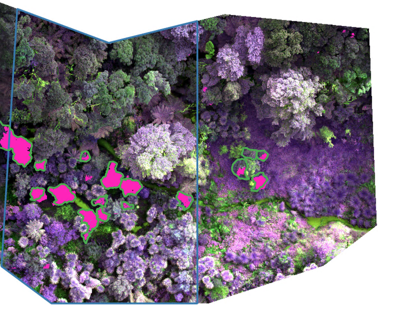
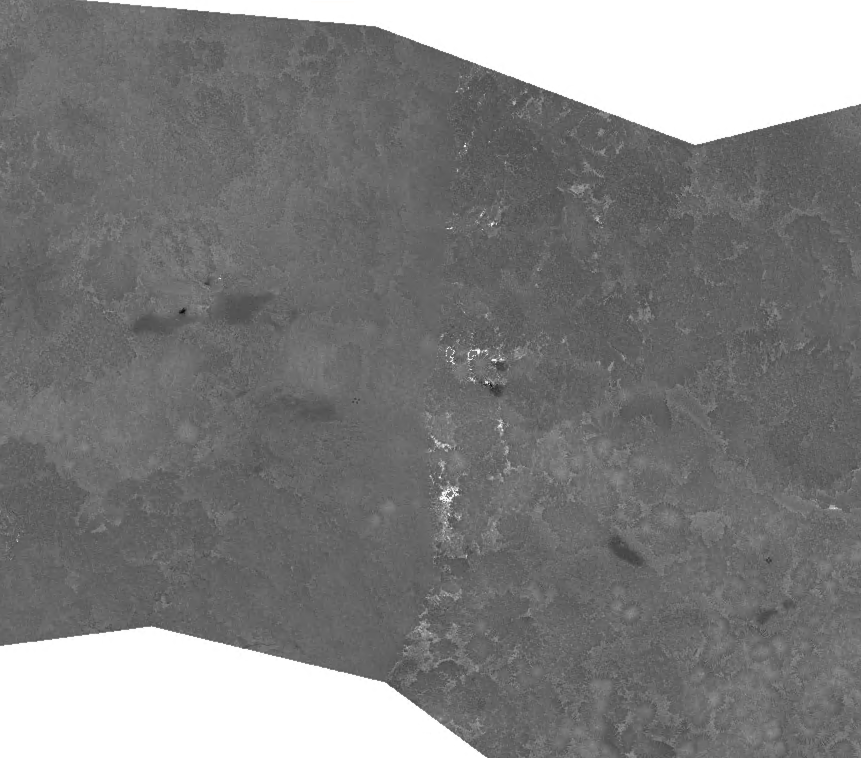

# Agenda
- [ ] progress overview
    + Focus mainly on MS data in past weeks
        - DL on non-terrestrial pointclouds, especially on bushy/dense vegetation is not possible/outside the scope of a MS thesis
        --> will try to use LiDAR data for health assesment once trees identified.
    + separate processing of rgb and ms data in metashape --> improve quality
    + labelling completed
    + sucessful first identification with DL unet model (@fig-results)

- [ ] **Problems**
    - not enough training data
    - MS data from Council for Bushglen is not calibrated with reflectance panel
    - MS for Kauri Glen and Eskdale captured under changing conditions --> visible washing effects (@fig-reflection)

- [ ] next steps:
    + Get more MS data from more Swamp Maires
        --> check out sites with tagged Maires on iNaturalist
        --> fly these sites and fly Eskdale + Kauri Glen again
    + Get bbox for Bushglen (i need controller for this, as flighthub doesn't have that drone or can you provide me with bbox?)
    + If this won't improve detection (e.g. the finding is that detection has major limitations):
        - how would that also end up in the paper?
        - i then would start to focus only on tree health assesment based on ground truthing.

{#fig-results}

# Meeting Notes

- Short paper about the importance of calibration and consistent flying conditions.
- species distribution model as option to identify more aereas (for following research)

## Flight planning

# Summary why to focus on MS data

I came to the conclusion to move away from LiDAR data for species identification as this leads into a dead end with the time available. The main reason for this is that there aren't any papers out there which use LiDAR data for species identification in dense forests. All papers which use LiDAR data for species identification focus on industrial plantations with coniferous trees. Most of them even use TLS (terrestrial laser scanning) as this allows for higher resolution of tree trunks and branches. However, the dense forest I'm looking at and the morphology of the Swamp Maires (e.g. very bushy / canopy rich), this is impossible or at least certainly outside the scope of a Master Thesis. Because of the first successful identification of Swamp Maires on MS data, I think its the more promising path to take from here onwards if I went out and tried to get some higher quality MS data in for the Swamp Maires (consistent weather conditions). Therefore, I would suggest not to invest too much time in getting flight approvals for Bushglen to do the oblique LiDAR flights and only do a small letter drop for the 4–5 neighbouring properties without the help of the council to only do MS flights and not do any LiDAR captures for Bushglen. I can still use the LiDAR for the health assessment using the Kauri Glen and Eskdale data I already have.

{#fig-reflection}