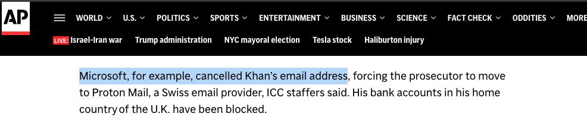
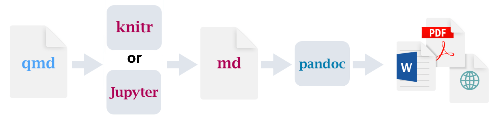
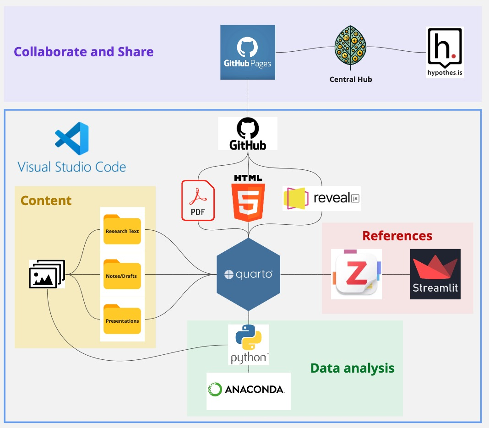
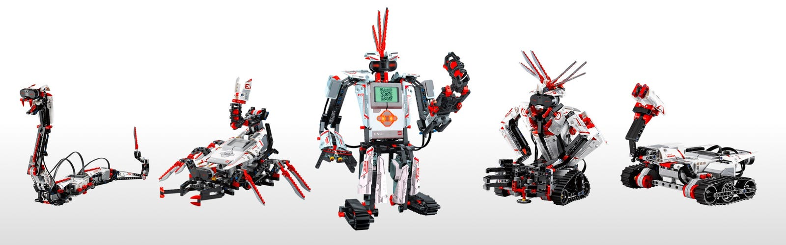
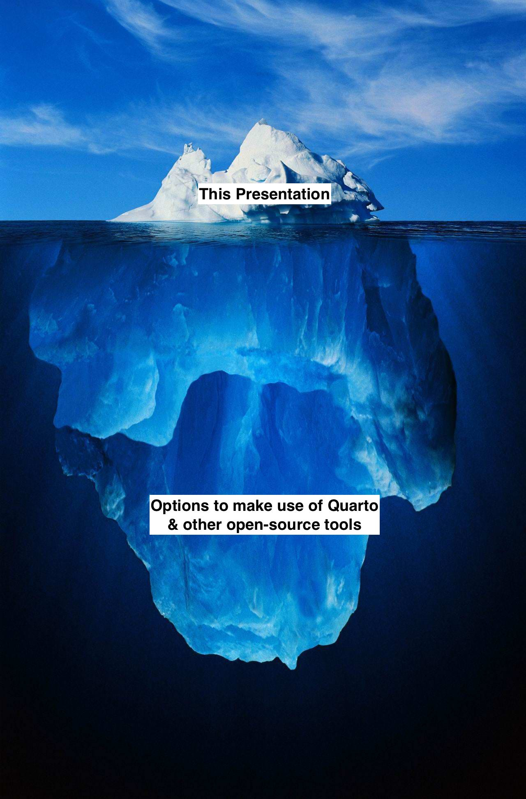

# Background

## {.smaller}
::: {.r-stack}
{width="600"}

{.fragment width="900"}
:::
::: footer
https://apnews.com/article/icc-trump-sanctions-karim-khan-court-a4b4c02751ab84c09718b1b95cbd5db3
:::

## 

> “Should relations with the US deteriorate, it is to be feared that Microsoft would be forced to shut everything down.”  
> — *Henrik Appel Espersen, President of the Audit Committee in Copenhagen*

::: footer
https://www.watson.ch/digital/wirtschaft/937368774-microsoft-software-ist-wegen-trump-sicherheitsrisiko-daenemark-reagiert
:::

##
{width="600" fig-align="center"}

::: footer
https://dig.watch/updates/denmark-moves-to-replace-microsoft-software-as-part-of-digital-sovereignty-strategy
:::

# Open-source in research workflows

##
::: {layout-ncol=2 layout-valign="center"}
Open-source
{height=300}

::: {.fragment}
Proprietary software
{height=300}
:::
:::

## {background-image="figures/quarto.jpg"}

## Quarto for research projects

- **Code integration** (R, Python, Julia, Observable JS)
- **Reproducibility**: Automatically update outputs when data/code changes
- **Multi-format publishing**: HTML, PDF, Word, Revealjs, Typst, etc.
- **Citation management** with CSL, BibTeX and Zotero
- Extensible with custom templates, filters and other tools

## Quarto in action

- Write a paper with embedded code and figures
- Interactive dashboards or visualizations
- [Build teaching materials or course websites](https://computationalmovementanalysis.github.io/FS25/) 
- Present with Revealjs slides

::: {.fragment}
**One tool to write, analyze, and publish — all in one place.**
:::

## The Quarto backbone

## My workflow {.smaller}
{fig-align="center" width=600 .lightbox}

## Let's jump into action!

- [My thesis website](https://pfaffrob.github.io/myrtle_rust/aa566b206b36b985ac2ad0e73eedfc197cc8d2ffc/a49feaef2cb36248f101629c1c173fe7eb51fc45c/)
- Zotero workflow demonstration

# Drawbacks

- steep learning curve
- easy to get lost (endless rabbit holes)
- new way of thinking
- different limitations
- not fully independent of big corporations (github, vscode, onedrive, etc.)

## Pros

- automate workflows
- build what is not available (AI is your best friend here)
- enormous flexibility
- no endless formating/prevent formating mistakes

##

::: {.r-stack}
{width="600"}

{.fragment width="1200"}
:::

##
{fig-align="center" width=500 .lightbox}