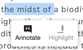
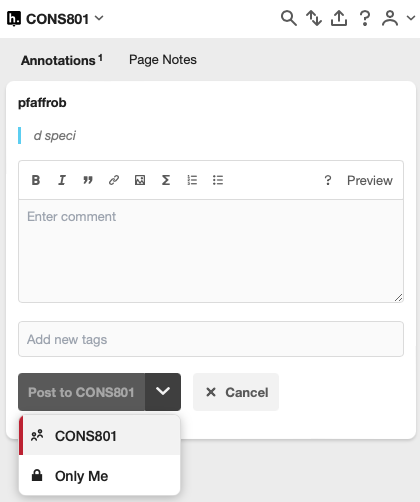

# Adding comments with [hypothes.is](https://hypothes.is) {#sec-comments}

1. Highlight text you want to comment
2. Click on Annotate

3. Login/Sign up to [hypothes.is](https://hypothes.is) and join the myrtle_rust group. The group invite link can be found [here](https://autuni-my.sharepoint.com/:t:/g/personal/kqn7759_autuni_ac_nz/EXjNyndPP_1MpJ2G_BD7CgsBQXerSPY5pBIB1jEw7z7hVg) and is accessible with your AUT e-mail. Let me know if that doesn't work.
4. Write comment
5. Post to group **myrtle_rust** to make comment visible for everyone in the group.

