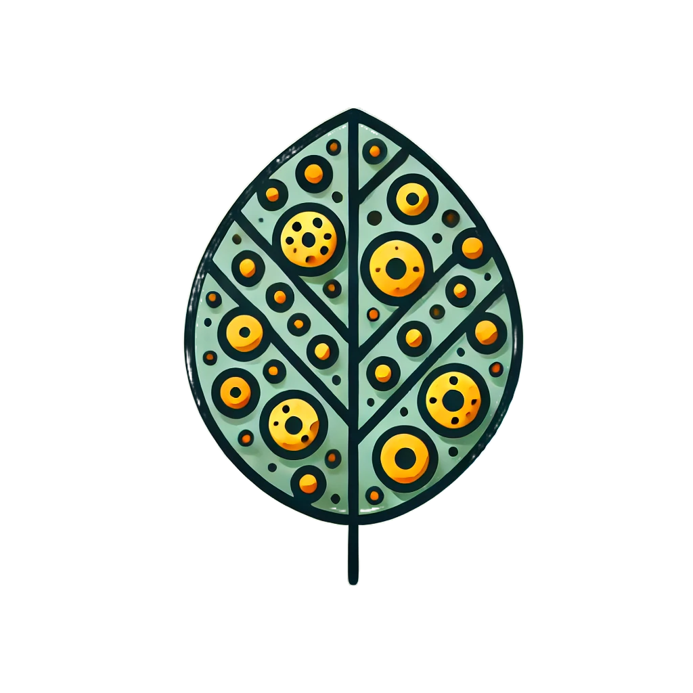

<!-- 
Here is a template for a nice looking homepage.

I make heavy use of ::: syntax which allows me to create html-like divs and classes in markdown.

the general structure is:

:::{.some-class}
    some content modified by the class
:::

Often you can use multiple classes like this:

:::{.class1 .class2}
    some content modified by the classes
:::

or 

:::{.class1}
    :::{.class2}
        some content modified by the classes
    :::
:::

-->

<!-- 
this defines how wide the content should be
check https://quarto.org/docs/authoring/article-layout.html#page-column
for more information
 -->
:::{.column-page} 

\ 
<!-- '\' is a spacer -->

:::: {.columns}

::: {.column style="padding-right: 20px;"}

::: {.animate__animated .animate__fadeIn style="--animate-duration: 2s;"}

:::

:::

::: {.column style="padding-left: 20px;"}

### Welcome to the central hub for Robin's master thesis on Myrtle Rust detection

This is the central hub for my master thesis. The main purpose for this website is to share meeting notes, drafts of chapters and receive feedback using [hypothesis](https://hypothes.is). A guide on how to add comments can be found in the [documentation section](1_9_documentation/index.qmd#sec-comments). 

As I am constantly improving on my [quarto](https://quarto.org) skills, it is still to be defined to which extent this website will also be used to collaborate on data and code.

Also please note that this website was built off a [template by Lukas W. Mayer](https://lukmayer.github.io/blog/posts/quarto_template/) and still contains some contents irrelevant for this project. Furthermore, the citation settings for the pdf are not correct yet, as I'm moving from the latex to the [typst](https://quarto.org/docs/output-formats/typst.html) engine for pdf rendering.

\

<!-- 

Here is how we can specify some buttons with links in html
you can very easily ask chatgpt to modify this to your liking if you dont know how to modify this yourself
make sure it knows that you use the bootstrap icon set

-->

<a href="mailto:kqn7759@autuni.ac.nz" class="button-link" target="_blank" style="text-decoration: none; color: white; background-color: #222; padding: 10px 20px; border-radius: 5px; display: inline-block; font-size: 1.2rem; text-align: center;">
    <i class="bi bi-envelope" style="font-size: 1.5rem; margin-right: 8px;"></i>Email
</a>

<a href="https://github.com/pfaffrob/myrtle_rust" class="button-link" target="_blank" style="text-decoration: none; color: white; background-color: #222; padding: 10px 20px; border-radius: 5px; display: inline-block; font-size: 1.2rem; text-align: center;">
    <i class="bi bi-github" style="font-size: 1.5rem; margin-right: 8px;"></i>Github
</a>

<a href="https://www.linkedin.com/in/robin-pfaff-3454702b7/" class="button-link" target="_blank" style="text-decoration: none; color: white; background-color: #222; padding: 10px 20px; border-radius: 5px; display: inline-block; font-size: 1.2rem; text-align: center;">
    <i class="bi bi-linkedin" style="font-size: 1.5rem; margin-right: 8px;"></i>LinkedIn
</a>

:::

::::  

:::

<!-- 
below is some css code that ensures that the buttons are styled correctly
and also work on mobile devices

you should not need to modify this other than the color values
I have not tried wether this works ok for more than 3 buttons
 -->

